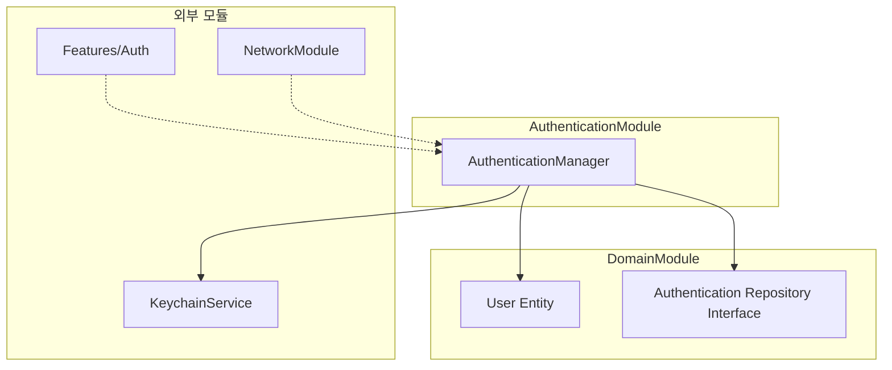

# AuthenticationModule

## 모듈 개요

AuthenticationModule은 Toss Bank Clone 애플리케이션의 인증 관련 기능을 담당하는 모듈입니다. 사용자 인증(로그인, 회원가입, 로그아웃 등), 토큰 관리, 인증 상태 유지 등 애플리케이션의 보안 관련 핵심 기능을 제공합니다.

## 아키텍처



## 의존성 관계

- **의존하는 모듈**:
  - DomainModule: 사용자 엔티티 및 인증 관련 인터페이스 사용
  
- **의존받는 모듈**:
  - Features/Auth: 로그인, 회원가입 등 인증 관련 기능 구현
  - NetworkModule: 인증 토큰을 통한 API 요청

## 폴더 구조

```
AuthenticationModule/
├── Sources/
│   └── Manager/
│       └── AuthenticationManager.swift - 인증 관리자 구현
```

## 주요 컴포넌트

### AuthenticationManager

사용자 인증 및 토큰 관리를 담당하는 핵심 클래스입니다.

```swift
class AuthenticationManager {
    // 인증 상태 열거형
    enum AuthState {
        case authenticated(User)
        case unauthenticated
        case loading
    }
    
    // 현재 인증 상태
    @Published private(set) var authState: AuthState = .unauthenticated
    
    // 인증 토큰
    private var authToken: String?
    
    // 종속성
    private let keychainService: KeychainService
    private let authRepository: AuthRepository
    
    init(keychainService: KeychainService, authRepository: AuthRepository) {
        self.keychainService = keychainService
        self.authRepository = authRepository
        
        // 저장된 토큰이 있으면 자동 로그인
        checkSavedToken()
    }
    
    // 로그인 메서드
    func login(username: String, password: String) async throws -> User {
        // 로그인 로직 구현
        // ...
    }
    
    // 회원가입 메서드
    func register(username: String, password: String, email: String) async throws -> User {
        // 회원가입 로직 구현
        // ...
    }
    
    // 로그아웃 메서드
    func logout() {
        // 로그아웃 로직 구현
        // ...
    }
    
    // 토큰 갱신 메서드
    func refreshToken() async throws {
        // 토큰 갱신 로직 구현
        // ...
    }
    
    // 저장된 토큰 확인
    private func checkSavedToken() {
        // 토큰 확인 로직 구현
        // ...
    }
    
    // 현재 사용자 가져오기
    func getCurrentUser() -> User? {
        // 현재 사용자 가져오기 로직 구현
        // ...
    }
    
    // 인증 상태 체크
    func isAuthenticated() -> Bool {
        // 인증 상태 확인 로직 구현
        // ...
    }
}
```

## 사용 방법

1. AuthenticationManager 초기화:

```swift
let keychainService = KeychainService()
let authRepository = AuthRepositoryImpl(networkService: networkService)
let authManager = AuthenticationManager(
    keychainService: keychainService,
    authRepository: authRepository
)
```

2. 로그인 수행:

```swift
do {
    let user = try await authManager.login(username: "user123", password: "password123")
    // 로그인 성공 처리
    print("로그인 성공: \(user.name)")
} catch {
    // 로그인 실패 처리
    print("로그인 실패: \(error)")
}
```

3. 인증 상태 관찰:

```swift
// SwiftUI에서 사용 예시
struct AuthStateView: View {
    @StateObject private var authManager: AuthenticationManager = DependencyContainer.shared.authManager
    
    var body: some View {
        switch authManager.authState {
        case .authenticated(let user):
            HomeView(user: user)
        case .unauthenticated:
            LoginView()
        case .loading:
            ProgressView()
        }
    }
}
```

4. 로그아웃:

```swift
authManager.logout()
// UI 업데이트는 authState Publisher를 통해 자동으로 처리됨
```

## 구현 원리

AuthenticationModule은 다음 원칙에 따라 구현되었습니다:

1. **보안 최우선**: 민감한 인증 정보는 안전하게 저장 및 관리
2. **상태 관리**: 인증 상태를 명확히 정의하고 관찰 가능하게 함
3. **책임 분리**: 인증 관련 로직을 다른 모듈과 분리
4. **추상화**: 인증 메커니즘의 세부 구현을 추상화하여 변경에 유연하게 대응

특히, 토큰 저장에는 KeychainService를 사용하여 보안을 강화하였으며, Combine 프레임워크의 @Published 속성을 활용하여 반응형 상태 관리를 구현했습니다. 