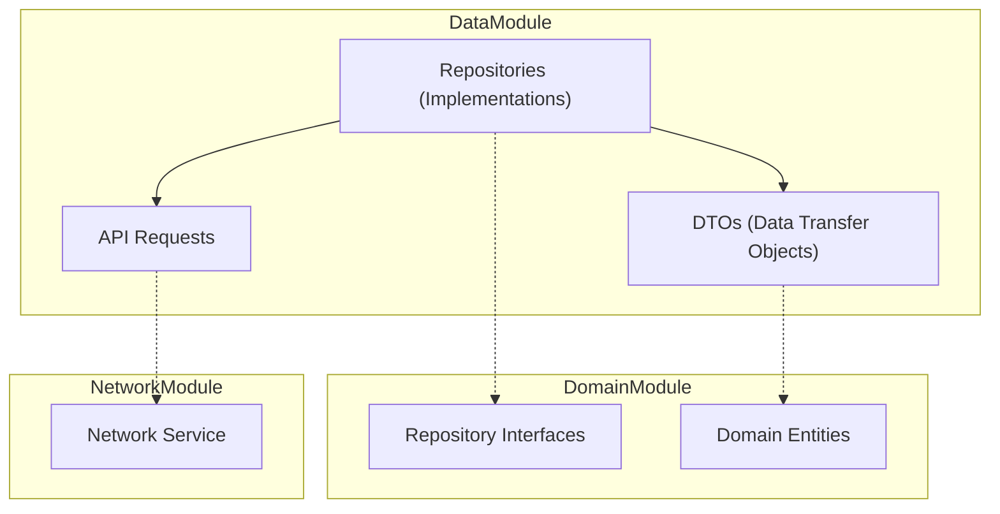

# DataModule

## 모듈 개요

DataModule은 Toss Bank Clone 애플리케이션의 데이터 접근 계층을 담당하는 모듈입니다. Clean Architecture의 Data Layer에 해당하며, DomainModule에 정의된 리포지토리 인터페이스를 구현하고 데이터 소스(네트워크, 로컬 데이터베이스 등)와의 통신을 관리합니다.

## 아키텍처



## 의존성 관계

- **의존하는 모듈**:
  - DomainModule: 리포지토리 인터페이스 및 도메인 엔티티 사용
  - NetworkModule: 네트워크 요청 처리

- **의존받는 모듈**:
  - Features: 각 기능 모듈에서 리포지토리 구현체 사용

## 폴더 구조

```
DataModule/
├── Sources/
│   ├── Repositories/  - 리포지토리 구현체
│   ├── DTOs/          - 데이터 전송 객체
│   └── APIRequests/   - API 요청 관련 코드
```

## 주요 컴포넌트

### Repositories

DomainModule에 정의된 리포지토리 인터페이스의 구현체입니다. 데이터 소스에서 데이터를 가져오고, 필요한 경우 도메인 모델로 변환합니다.

```swift
class AccountRepositoryImpl: AccountRepository {
    private let networkService: NetworkService
    
    init(networkService: NetworkService) {
        self.networkService = networkService
    }
    
    func getAccounts() async throws -> [Account] {
        let accountDTOs = try await networkService.request(
            AccountAPIRequest.getAccounts
        )
        return accountDTOs.map { $0.toDomain() }
    }
    
    func getAccount(id: String) async throws -> Account {
        let accountDTO = try await networkService.request(
            AccountAPIRequest.getAccount(id: id)
        )
        return accountDTO.toDomain()
    }
    
    func getTransactions(accountId: String) async throws -> [Transaction] {
        let transactionDTOs = try await networkService.request(
            AccountAPIRequest.getTransactions(accountId: accountId)
        )
        return transactionDTOs.map { $0.toDomain() }
    }
}
```

### DTOs (Data Transfer Objects)

네트워크 응답 또는 로컬 데이터베이스에서 사용되는 데이터 모델입니다. 도메인 모델로 변환하는 메서드를 포함합니다.

```swift
struct AccountDTO: Decodable {
    let id: String
    let name: String
    let balance: Double
    let currency: String
    
    func toDomain() -> Account {
        return Account(
            id: id,
            name: name,
            balance: balance,
            currency: currency
        )
    }
}
```

### APIRequests

네트워크 요청을 정의하는 코드입니다. NetworkModule의 NetworkService와 함께 사용됩니다.

```swift
enum AccountAPIRequest {
    case getAccounts
    case getAccount(id: String)
    case getTransactions(accountId: String)
}

extension AccountAPIRequest: APIRequest {
    var path: String {
        switch self {
        case .getAccounts:
            return "/accounts"
        case .getAccount(let id):
            return "/accounts/\(id)"
        case .getTransactions(let accountId):
            return "/accounts/\(accountId)/transactions"
        }
    }
    
    var method: HTTPMethod {
        return .get
    }
    
    // 기타 필요한 메서드 구현
}
```

## 사용 방법

1. 리포지토리 구현체 생성:

```swift
// Repositories/UserRepositoryImpl.swift
class UserRepositoryImpl: UserRepository {
    private let networkService: NetworkService
    
    init(networkService: NetworkService) {
        self.networkService = networkService
    }
    
    func getUser(id: String) async throws -> User {
        let userDTO = try await networkService.request(UserAPIRequest.getUser(id: id))
        return userDTO.toDomain()
    }
    
    func saveUser(_ user: User) async throws {
        let userDTO = UserDTO(from: user)
        try await networkService.request(UserAPIRequest.saveUser(user: userDTO))
    }
}
```

2. DTO 정의:

```swift
// DTOs/UserDTO.swift
struct UserDTO: Codable {
    let id: String
    let name: String
    let email: String
    
    init(from user: User) {
        self.id = user.id
        self.name = user.name
        self.email = user.email
    }
    
    func toDomain() -> User {
        return User(
            id: id,
            name: name,
            email: email
        )
    }
}
```

3. API 요청 정의:

```swift
// APIRequests/UserAPIRequest.swift
enum UserAPIRequest {
    case getUser(id: String)
    case saveUser(user: UserDTO)
}

extension UserAPIRequest: APIRequest {
    var path: String {
        switch self {
        case .getUser(let id):
            return "/users/\(id)"
        case .saveUser:
            return "/users"
        }
    }
    
    var method: HTTPMethod {
        switch self {
        case .getUser:
            return .get
        case .saveUser:
            return .post
        }
    }
    
    var body: Data? {
        switch self {
        case .getUser:
            return nil
        case .saveUser(let user):
            return try? JSONEncoder().encode(user)
        }
    }
}
```

## 구현 원리

DataModule은 다음 원칙에 따라 구현되었습니다:

1. **관심사 분리**: 데이터 접근 로직을 비즈니스 로직과 분리
2. **의존성 역전**: 구현체가 인터페이스에 의존하도록 함
3. **추상화**: 데이터 소스의 세부사항을 추상화하여 비즈니스 로직과 분리
4. **변환 책임**: DTO와 도메인 모델 간의 변환은 Data Layer에서 담당

이러한 원칙을 통해 데이터 소스가 변경되거나 새로운 요구사항이 추가되어도 비즈니스 로직에 영향을 미치지 않는 유연한 아키텍처를 구현할 수 있습니다. 