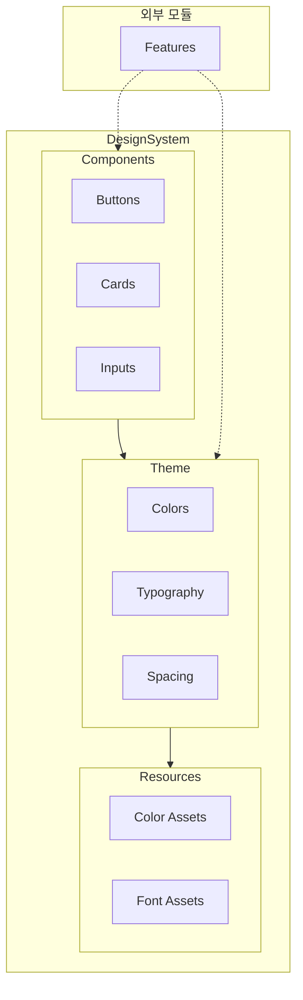

# DesignSystem

## 모듈 개요

DesignSystem은 Toss Bank Clone 애플리케이션의 디자인 시스템을 제공하는 모듈입니다. 일관된 UI 컴포넌트, 색상 체계, 타이포그래피, 아이콘 등을 제공하여 애플리케이션 전체의 디자인 일관성을 유지하고 개발 효율성을 향상시킵니다.

## 아키텍처



## 의존성 관계

- **의존하는 모듈**: 없음 (독립적인 모듈)
- **의존받는 모듈**:
  - 모든 Feature 모듈: UI 컴포넌트와 디자인 리소스 사용

## 폴더 구조

```
DesignSystem/
├── Sources/
│   ├── Theme/              - 디자인 시스템 테마
│   │   ├── ColorTokens.swift
│   │   ├── Typography.swift
│   │   └── Spacing.swift
│   ├── Components/         - 재사용 가능한 UI 컴포넌트
│   │   ├── Buttons/
│   │   ├── Cards/
│   │   └── Inputs/
│   └── Extensions/         - SwiftUI 확장
├── Resources/
│   ├── Colors.xcassets/    - 색상 에셋
│   │   ├── BrandPrimary.colorset/
│   │   ├── BrandSecondary.colorset/
│   │   ├── BackgroundPrimary.colorset/
│   │   └── ... (기타 색상)
│   └── Font/               - 폰트 리소스
```

## 주요 컴포넌트

### Theme

애플리케이션의 디자인 테마를 정의합니다.

#### Colors

색상 시스템을 정의합니다.

```swift
enum ColorTokens {
    // 브랜드 색상
    static let brandPrimary = Color("BrandPrimary")
    static let brandSecondary = Color("BrandSecondary")
    static let brandAccent = Color("BrandAccent")
    
    // 배경 색상
    static let backgroundPrimary = Color("BackgroundPrimary")
    static let backgroundSecondary = Color("BackgroundSecondary")
    static let backgroundTertiary = Color("BackgroundTertiary")
    static let backgroundInverse = Color("BackgroundInverse")
    static let backgroundCard = Color("BackgroundCard")
    
    // 텍스트 색상
    static let textPrimary = Color("TextPrimary")
    static let textSecondary = Color("TextSecondary")
    static let textDisabled = Color("TextDisabled")
    static let textInverse = Color("TextInverse")
    static let textLink = Color("TextLink")
    
    // 테두리 및 구분선
    static let borderPrimary = Color("BorderPrimary")
    static let borderDivider = Color("BorderDivider")
    
    // 레이어링
    static let layerOne = Color("LayerOne")
    static let layerTwo = Color("LayerTwo")
    static let layerThree = Color("LayerThree")
    
    // 효과
    static let effectShadow = Color("EffectShadow")
    
    // 상태 색상
    static let stateSuccess = Color("StateSuccess")
    static let stateWarning = Color("StateWarning")
    static let stateError = Color("StateError")
    static let stateInfo = Color("StateInfo")
}
```

#### Typography

타이포그래피 시스템을 정의합니다.

```swift
enum Typography {
    // 헤드라인
    static let headline1 = Font.system(size: 28, weight: .bold)
    static let headline2 = Font.system(size: 24, weight: .bold)
    static let headline3 = Font.system(size: 20, weight: .semibold)
    
    // 서브헤드라인
    static let subheadline1 = Font.system(size: 18, weight: .semibold)
    static let subheadline2 = Font.system(size: 16, weight: .semibold)
    
    // 본문
    static let body1 = Font.system(size: 16, weight: .regular)
    static let body2 = Font.system(size: 14, weight: .regular)
    
    // 캡션
    static let caption1 = Font.system(size: 12, weight: .regular)
    static let caption2 = Font.system(size: 10, weight: .regular)
}
```

### Components

재사용 가능한 UI 컴포넌트를 제공합니다.

#### Buttons

다양한 스타일의 버튼 컴포넌트를 제공합니다.

```swift
struct PrimaryButton: View {
    let title: String
    let action: () -> Void
    var isEnabled: Bool = true
    
    var body: some View {
        Button(action: action) {
            Text(title)
                .font(Typography.body1)
                .foregroundColor(ColorTokens.textInverse)
                .frame(maxWidth: .infinity)
                .padding()
        }
        .background(isEnabled ? ColorTokens.brandPrimary : ColorTokens.brandPrimary.opacity(0.5))
        .cornerRadius(8)
        .disabled(!isEnabled)
    }
}

struct SecondaryButton: View {
    let title: String
    let action: () -> Void
    var isEnabled: Bool = true
    
    var body: some View {
        Button(action: action) {
            Text(title)
                .font(Typography.body1)
                .foregroundColor(ColorTokens.brandPrimary)
                .frame(maxWidth: .infinity)
                .padding()
        }
        .background(ColorTokens.backgroundPrimary)
        .overlay(
            RoundedRectangle(cornerRadius: 8)
                .stroke(ColorTokens.brandPrimary, lineWidth: 1)
        )
        .cornerRadius(8)
        .disabled(!isEnabled)
    }
}
```

#### Cards

카드 형태의 컴포넌트를 제공합니다.

```swift
struct StandardCard<Content: View>: View {
    let content: Content
    
    init(@ViewBuilder content: () -> Content) {
        self.content = content()
    }
    
    var body: some View {
        content
            .padding()
            .background(ColorTokens.backgroundCard)
            .cornerRadius(12)
            .shadow(
                color: ColorTokens.effectShadow.opacity(0.1),
                radius: 8,
                x: 0,
                y: 2
            )
    }
}
```

#### Inputs

입력 필드 컴포넌트를 제공합니다.

```swift
struct StandardTextField: View {
    let placeholder: String
    @Binding var text: String
    var keyboardType: UIKeyboardType = .default
    var isSecure: Bool = false
    
    var body: some View {
        VStack(alignment: .leading, spacing: 4) {
            if isSecure {
                SecureField(placeholder, text: $text)
                    .font(Typography.body1)
                    .padding()
                    .background(ColorTokens.backgroundSecondary)
                    .cornerRadius(8)
            } else {
                TextField(placeholder, text: $text)
                    .font(Typography.body1)
                    .keyboardType(keyboardType)
                    .padding()
                    .background(ColorTokens.backgroundSecondary)
                    .cornerRadius(8)
            }
        }
    }
}
```

## 사용 방법

1. 색상 시스템 사용:

```swift
Text("안녕하세요!")
    .foregroundColor(ColorTokens.textPrimary)
    .background(ColorTokens.backgroundPrimary)
```

2. 타이포그래피 사용:

```swift
Text("헤드라인")
    .font(Typography.headline1)

Text("본문")
    .font(Typography.body1)
```

3. 버튼 컴포넌트 사용:

```swift
PrimaryButton(title: "로그인", action: {
    // 로그인 로직
})

SecondaryButton(title: "취소", action: {
    // 취소 로직
})
```

4. 카드 컴포넌트 사용:

```swift
StandardCard {
    VStack(alignment: .leading, spacing: 8) {
        Text("카드 제목")
            .font(Typography.headline3)
            .foregroundColor(ColorTokens.textPrimary)
        
        Text("카드 내용")
            .font(Typography.body1)
            .foregroundColor(ColorTokens.textSecondary)
    }
}
```

5. 입력 필드 사용:

```swift
@State private var username: String = ""

StandardTextField(
    placeholder: "사용자 이름",
    text: $username
)
```

## 구현 원리

DesignSystem은 다음 원칙에 따라 구현되었습니다:

1. **일관성**: 일관된 디자인 언어를 통한 사용자 경험 향상
2. **재사용성**: 재사용 가능한 컴포넌트로 개발 효율성 증대
3. **유지보수성**: 디자인 변경 시 중앙 집중식 관리로 유지보수 용이
4. **확장성**: 새로운 컴포넌트와 스타일 추가가 용이한 구조

특히, 색상 관리에는 SwiftUI의 Color Assets을 활용하여 다크 모드 대응과 같은 시스템 변화에 자동으로 적응할 수 있도록 구현하였습니다. 이를 통해 다양한 환경에서도 일관된 브랜드 경험을 제공할 수 있습니다. 