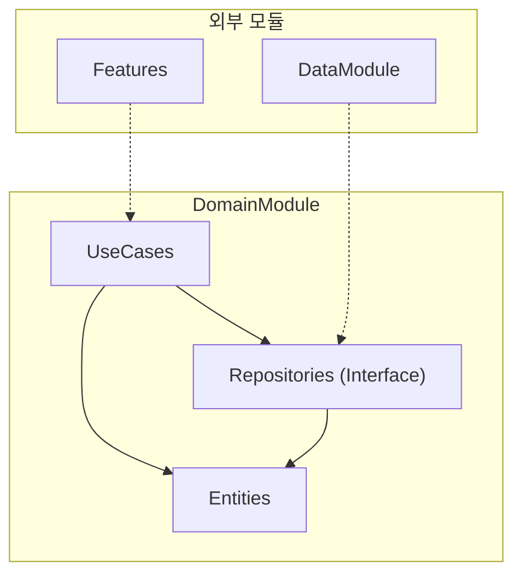

# DomainModule

## 모듈 개요

DomainModule은 Toss Bank Clone 애플리케이션의 핵심 비즈니스 로직을 담당하는 모듈입니다. Clean Architecture의 Domain Layer에 해당하며, 애플리케이션의 비즈니스 규칙과 엔티티를 정의합니다.

## 아키텍처



## 의존성 관계

- **의존하는 모듈**: 없음 (독립적인 모듈)
- **의존받는 모듈**: 
  - DataModule: 리포지토리 인터페이스 구현
  - AuthenticationModule: 인증 관련 도메인 사용
  - Features: 각 기능 모듈에서 비즈니스 로직 사용

DomainModule은 Clean Architecture의 원칙에 따라 외부 계층에 대한 의존성이 없습니다. 대신, 외부 계층(DataModule, Features 등)이 DomainModule에 의존합니다.

## 폴더 구조

```
DomainModule/
├── Sources/
│   ├── Entities/      - 비즈니스 모델 정의
│   ├── Repositories/  - 리포지토리 인터페이스
│   └── UseCases/      - 비즈니스 로직 및 유스케이스
```

## 주요 컴포넌트

### Entities

비즈니스 모델을 정의합니다. 애플리케이션의 핵심 데이터 구조와 비즈니스 규칙을 포함합니다.

예: Account, Transaction, User 등

### Repositories

데이터 접근을 위한 인터페이스를 정의합니다. 실제 구현은 DataModule에서 이루어집니다.

```swift
protocol AccountRepository {
    func getAccounts() async throws -> [Account]
    func getAccount(id: String) async throws -> Account
    func getTransactions(accountId: String) async throws -> [Transaction]
}
```

### UseCases

애플리케이션의 비즈니스 로직을 구현합니다. 각 유스케이스는 단일 책임 원칙에 따라 하나의 기능을 담당합니다.

```swift
class GetAccountsUseCase {
    private let repository: AccountRepository
    
    init(repository: AccountRepository) {
        self.repository = repository
    }
    
    func execute() async throws -> [Account] {
        return try await repository.getAccounts()
    }
}
```

## 사용 방법

1. 새로운 비즈니스 모델 추가:
   
```swift
// Entities/User.swift
struct User: Identifiable, Codable {
    let id: String
    let name: String
    let email: String
}
```

2. 리포지토리 인터페이스 정의:

```swift
// Repositories/UserRepository.swift
protocol UserRepository {
    func getUser(id: String) async throws -> User
    func saveUser(_ user: User) async throws
}
```

3. 유스케이스 구현:

```swift
// UseCases/GetUserUseCase.swift
class GetUserUseCase {
    private let repository: UserRepository
    
    init(repository: UserRepository) {
        self.repository = repository
    }
    
    func execute(userId: String) async throws -> User {
        return try await repository.getUser(id: userId)
    }
}
```

## 구현 원리

DomainModule은 Clean Architecture의 다음 원칙을 따릅니다:

1. **독립성**: 외부 프레임워크나 라이브러리에 의존하지 않음
2. **테스트 용이성**: 외부 의존성 없이 비즈니스 로직을 테스트할 수 있음
3. **의존성 규칙**: 의존성은 항상 외부 계층에서 내부 계층으로 향함
4. **경계 분리**: 비즈니스 로직과 데이터 접근 로직을 분리

이러한 원칙을 통해 비즈니스 로직은 데이터 소스나 UI 변경과 독립적으로 진화할 수 있습니다. 