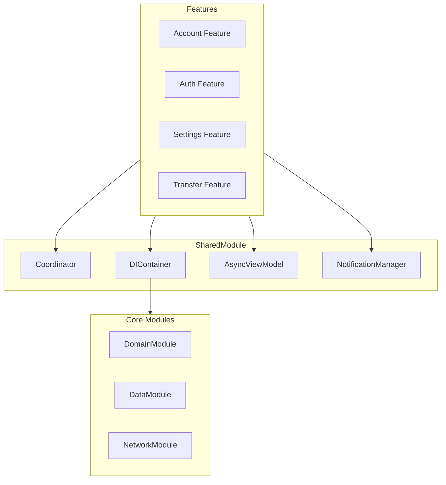

# SharedModule

## 모듈 개요

SharedModule은 Toss Bank Clone 애플리케이션에서 여러 모듈이 공통으로 사용하는 기능들을 모아놓은 모듈입니다. 코디네이터 패턴, 의존성 주입, 비동기 뷰모델 패턴, 알림 관리 등 앱 전반에 걸쳐 사용되는 핵심 유틸리티와 디자인 패턴을 제공합니다.

## 아키텍처



## 의존성 관계

- **의존하는 모듈**: 없음 (독립적인 모듈)
- **의존받는 모듈**:
  - 모든 Feature 모듈: 코디네이터, DI 컨테이너, 비동기 뷰모델 등 사용
  - App: 앱 레벨의 DI 컨테이너 및 코디네이터 구성

## 폴더 구조

```
SharedModule/
├── Sources/
│   ├── Coordinator/       - 화면 전환 및 내비게이션 관리
│   │   └── Coordinator.swift
│   ├── DIContainer/       - 의존성 주입 컨테이너
│   │   └── DIContainer.swift
│   ├── AsyncViewModel/    - 비동기 뷰모델 패턴
│   │   ├── AsyncViewModel.swift
│   │   └── README.md      - 상세 사용 가이드
│   └── Notification/      - 앱 내 알림 관리
│       └── NotificationManager.swift
```

## 주요 컴포넌트

### Coordinator

화면 간 전환 및 내비게이션 흐름을 관리하는 코디네이터 패턴을 구현합니다.

```swift
protocol Coordinator: AnyObject {
    var childCoordinators: [Coordinator] { get set }
    var navigationController: UINavigationController { get }
    
    func start()
    func finish()
    func coordinate(to coordinator: Coordinator)
    func removeChild(_ coordinator: Coordinator)
}

extension Coordinator {
    func coordinate(to coordinator: Coordinator) {
        childCoordinators.append(coordinator)
        coordinator.start()
    }
    
    func removeChild(_ coordinator: Coordinator) {
        childCoordinators.removeAll { $0 === coordinator }
    }
    
    func finish() {
        childCoordinators.forEach { $0.finish() }
        childCoordinators.removeAll()
    }
}
```

### DIContainer (Dependency Injection Container)

의존성 주입을 관리하는 컨테이너를 제공합니다.

```swift
protocol DIContainer {
    func register<T>(_ dependency: T, for type: T.Type)
    func resolve<T>(_ type: T.Type) -> T?
}

class AppDIContainer: DIContainer {
    private var dependencies: [String: Any] = [:]
    
    func register<T>(_ dependency: T, for type: T.Type) {
        let key = String(describing: type)
        dependencies[key] = dependency
    }
    
    func resolve<T>(_ type: T.Type) -> T? {
        let key = String(describing: type)
        return dependencies[key] as? T
    }
}
```

### AsyncViewModel

비동기 작업을 체계적으로 처리하기 위한 MVVM 패턴 구현을 제공합니다.

```swift
@MainActor
protocol AsyncViewModel: ObservableObject {
    associatedtype Input
    associatedtype Action
    
    /// 사용자 입력을 액션으로 변환
    nonisolated func transform(_ input: Input) async throws -> [Action]
    
    /// 액션을 수행하여 상태 업데이트
    func perform(_ action: Action) async throws
    
    /// 에러 처리
    func handleError(_ error: Error) async
    
    /// 입력 전송 메서드 (기본 구현 제공)
    func send(_ input: Input)
}

extension AsyncViewModel {
    func send(_ input: Input) {
        Task {
            do {
                let actions = try await transform(input)
                for action in actions {
                    try await perform(action)
                }
            } catch {
                await handleError(error)
            }
        }
    }
}
```

### NotificationManager

앱 내 알림 및 푸시 알림을 관리하는 매니저를 제공합니다.

```swift
class NotificationManager {
    // 알림 타입 정의
    enum NotificationType {
        case transfer(amount: Decimal, recipient: String)
        case login(location: String, time: Date)
        case accountActivity(message: String)
        // 기타 알림 타입
    }
    
    // 로컬 알림 전송
    func scheduleLocalNotification(type: NotificationType) {
        // 알림 구성 및 전송 로직
    }
    
    // 푸시 알림 등록
    func registerForPushNotifications() {
        // 푸시 알림 등록 로직
    }
    
    // 알림 권한 요청
    func requestNotificationAuthorization() {
        // 권한 요청 로직
    }
    
    // 알림 처리
    func handleNotificationResponse(_ response: UNNotificationResponse) {
        // 알림 응답 처리 로직
    }
}
```

## 사용 방법

### 1. Coordinator 사용하기

```swift
class AccountCoordinator: Coordinator {
    var childCoordinators: [Coordinator] = []
    let navigationController: UINavigationController
    private let diContainer: DIContainer
    
    init(navigationController: UINavigationController, diContainer: DIContainer) {
        self.navigationController = navigationController
        self.diContainer = diContainer
    }
    
    func start() {
        let accountListViewModel = diContainer.resolve(AccountListViewModel.self)!
        let accountListViewController = AccountListViewController(viewModel: accountListViewModel)
        accountListViewController.coordinator = self
        navigationController.pushViewController(accountListViewController, animated: true)
    }
    
    func showAccountDetail(accountId: String) {
        let accountDetailViewModel = diContainer.resolve(AccountDetailViewModel.self)!
        accountDetailViewModel.configure(with: accountId)
        let accountDetailViewController = AccountDetailViewController(viewModel: accountDetailViewModel)
        accountDetailViewController.coordinator = self
        navigationController.pushViewController(accountDetailViewController, animated: true)
    }
}
```

### 2. DIContainer 사용하기

```swift
// 앱 시작 시 의존성 등록
let diContainer = AppDIContainer()

// 서비스 등록
let networkService = NetworkService(baseURL: URL(string: "https://api.example.com")!)
diContainer.register(networkService, for: NetworkService.self)

// 리포지토리 등록
let accountRepository = AccountRepositoryImpl(networkService: networkService)
diContainer.register(accountRepository, for: AccountRepository.self)

// 뷰모델 등록
let accountListViewModel = AccountListViewModel(accountRepository: accountRepository)
diContainer.register(accountListViewModel, for: AccountListViewModel.self)

// 의존성 해결
let resolvedViewModel = diContainer.resolve(AccountListViewModel.self)!
```

### 3. AsyncViewModel 사용하기

```swift
final class AccountListViewModel: AsyncViewModel {
    enum Input {
        case loadAccounts
        case refreshAccounts
        case selectAccount(id: String)
    }
    
    enum Action {
        case fetchAccounts
        case updateAccountList
        case navigateToDetail(id: String)
    }
    
    @Published var accounts: [Account] = []
    @Published var isLoading = false
    @Published var errorMessage: String?
    
    private let accountRepository: AccountRepository
    var onAccountSelected: ((String) -> Void)?
    
    init(accountRepository: AccountRepository) {
        self.accountRepository = accountRepository
    }
    
    nonisolated func transform(_ input: Input) async throws -> [Action] {
        switch input {
        case .loadAccounts:
            return [.fetchAccounts]
        case .refreshAccounts:
            return [.fetchAccounts, .updateAccountList]
        case .selectAccount(let id):
            return [.navigateToDetail(id: id)]
        }
    }
    
    func perform(_ action: Action) async throws {
        switch action {
        case .fetchAccounts:
            isLoading = true
            defer { isLoading = false }
            accounts = try await accountRepository.getAccounts()
        case .updateAccountList:
            // 추가 업데이트 로직
            break
        case .navigateToDetail(let id):
            onAccountSelected?(id)
        }
    }
    
    func handleError(_ error: Error) async {
        errorMessage = error.localizedDescription
    }
}

// View에서 사용
struct AccountListView: View {
    @StateObject var viewModel: AccountListViewModel
    
    var body: some View {
        List(viewModel.accounts) { account in
            AccountRow(account: account)
                .onTapGesture {
                    viewModel.send(.selectAccount(id: account.id))
                }
        }
        .onAppear {
            viewModel.send(.loadAccounts)
        }
        .refreshable {
            viewModel.send(.refreshAccounts)
        }
    }
}
```

### 4. NotificationManager 사용하기

```swift
let notificationManager = NotificationManager()

// 권한 요청
notificationManager.requestNotificationAuthorization()

// 푸시 알림 등록
notificationManager.registerForPushNotifications()

// 로컬 알림 전송
notificationManager.scheduleLocalNotification(
    type: .transfer(amount: 50.0, recipient: "홍길동")
)
```

## 구현 원리

SharedModule은 다음 원칙에 따라 구현되었습니다:

1. **단일 책임 원칙**: 각 컴포넌트는 명확한 하나의 책임을 가짐
2. **관심사 분리**: 내비게이션, 의존성 관리, 상태 관리 등을 명확히 분리
3. **재사용성**: 여러 모듈에서 일관되게 사용할 수 있는 패턴 제공
4. **확장성**: 각 컴포넌트가 쉽게 확장될 수 있는 구조

특히, AsyncViewModel 패턴은 현대적인 Swift Concurrency 모델을 활용하여 비동기 작업을 체계적으로 처리할 수 있도록 설계되었으며, 코디네이터 패턴은 화면 전환 로직을 뷰 컨트롤러에서 분리하여 더 모듈화된 구조를 만드는 데 기여합니다. 