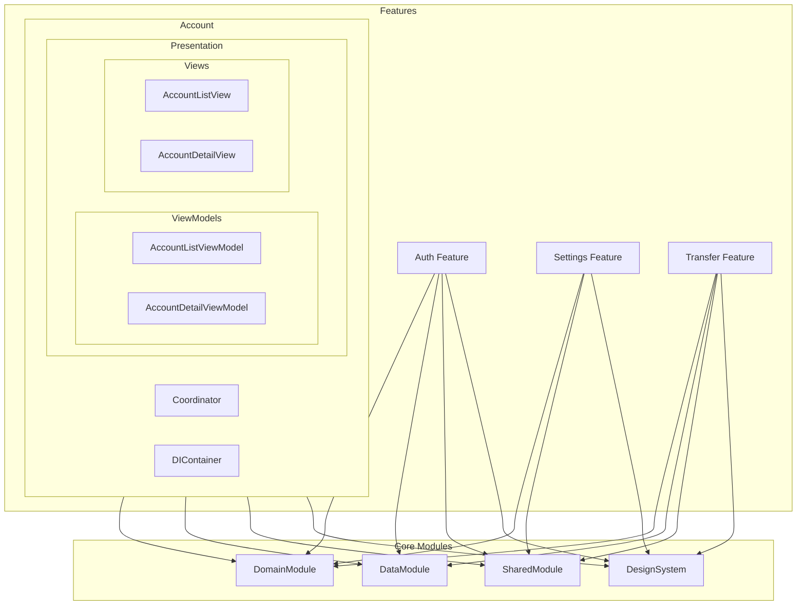

# Features

## 모듈 개요

Features는 Toss Bank Clone 애플리케이션의 주요 기능들을 담당하는 모듈들의 집합입니다. 각 기능은 독립된 모듈로 구성되어 있으며, Clean Architecture와 MVVM 패턴을 기반으로 구현되었습니다. 사용자와 직접 상호작용하는 화면들과 그에 필요한 비즈니스 로직이 포함되어 있습니다.

## 아키텍처



## 의존성 관계

- **의존하는 모듈**:
  - DomainModule: 비즈니스 모델 및 유스케이스 사용
  - DataModule: 리포지토리 구현체 사용
  - SharedModule: 코디네이터, DI 컨테이너, 비동기 뷰모델 패턴 등 사용
  - DesignSystem: UI 컴포넌트 및 디자인 요소 사용

- **의존받는 모듈**:
  - App: 앱 레벨의 화면 구성에서 각 Feature 모듈 사용

## 폴더 구조

모든 Feature 모듈은 일관된 구조를 따릅니다:

```
Features/
├── Account/
│   ├── Resources/          - 기능별 리소스(이미지, 문자열 등)
│   └── Sources/
│       ├── Coordinators/   - 화면 전환 관리
│       ├── DIContainer/    - 의존성 주입 관리
│       └── Presentation/   - UI 관련 코드
│           ├── ViewModels/ - 뷰 모델
│           └── Views/      - SwiftUI 뷰
│               ├── AccountList/    - 계좌 목록 화면
│               └── AccountDetail/  - 계좌 상세 화면
│
├── Auth/
│   ├── Resources/
│   └── Sources/
│       ├── Coordinators/
│       ├── DIContainer/
│       └── Presentation/
│           ├── Controller/ - UIKit 화면 (필요한 경우)
│           ├── ViewModels/
│           └── Views/
│
├── Settings/
│   ├── Resources/
│   └── Sources/
│       ├── Coordinators/
│       ├── DIContainer/
│       ├── Presentation/
│       └── Utils/          - 설정 관련 유틸리티
│
└── Transfer/
    ├── Resources/
    └── Sources/
        ├── Coordinators/
        ├── DIContainer/
        └── Presentation/
```

## 주요 Feature 모듈

### Account

계좌 관련 기능을 제공합니다. 계좌 목록 조회, 계좌 상세 정보, 거래 내역 등을 포함합니다.

#### 주요 컴포넌트

- **AccountCoordinator**: 계좌 관련 화면 간 전환 관리
- **AccountListViewModel**: 계좌 목록 화면의 비즈니스 로직 처리
- **AccountDetailViewModel**: 계좌 상세 화면의 비즈니스 로직 처리
- **AccountListView**: 계좌 목록 UI
- **AccountDetailView**: 계좌 상세 정보 및 거래 내역 UI

### Auth

인증 관련 기능을 제공합니다. 로그인, 회원가입, 비밀번호 재설정 등을 포함합니다.

#### 주요 컴포넌트

- **AuthCoordinator**: 인증 관련 화면 간 전환 관리
- **LoginViewModel**: 로그인 화면의 비즈니스 로직 처리
- **RegisterViewModel**: 회원가입 화면의 비즈니스 로직 처리
- **LoginView**: 로그인 UI
- **RegisterView**: 회원가입 UI

### Settings

앱 설정 관련 기능을 제공합니다. 사용자 프로필 관리, 알림 설정, 보안 설정 등을 포함합니다.

#### 주요 컴포넌트

- **SettingsCoordinator**: 설정 관련 화면 간 전환 관리
- **SettingsViewModel**: 설정 메인 화면의 비즈니스 로직 처리
- **ProfileViewModel**: 프로필 관리 화면의 비즈니스 로직 처리
- **SettingsView**: 설정 메뉴 UI
- **ProfileView**: 프로필 관리 UI

### Transfer

송금 관련 기능을 제공합니다. 계좌 이체, 이체 내역, 이체 예약 등을 포함합니다.

#### 주요 컴포넌트

- **TransferCoordinator**: 송금 관련 화면 간 전환 관리
- **TransferViewModel**: 송금 화면의 비즈니스 로직 처리
- **RecipientListViewModel**: 수취인 목록 화면의 비즈니스 로직 처리
- **TransferView**: 송금 UI
- **TransferConfirmView**: 송금 확인 UI

## 사용 방법

### 1. Feature 모듈 초기화 및 사용

```swift
// App Coordinator에서 Feature 모듈 초기화 및 시작
class AppCoordinator: Coordinator {
    var childCoordinators: [Coordinator] = []
    let navigationController: UINavigationController
    private let diContainer: DIContainer
    
    init(navigationController: UINavigationController, diContainer: DIContainer) {
        self.navigationController = navigationController
        self.diContainer = diContainer
    }
    
    func start() {
        // 인증 상태에 따라 시작 화면 결정
        let authManager = diContainer.resolve(AuthenticationManager.self)!
        if authManager.isAuthenticated() {
            showMainTabs()
        } else {
            showAuth()
        }
    }
    
    private func showAuth() {
        let authCoordinator = AuthCoordinator(
            navigationController: navigationController,
            diContainer: diContainer
        )
        coordinate(to: authCoordinator)
        
        // 인증 성공 시 메인 화면으로 전환
        authCoordinator.onAuthenticationSuccessful = { [weak self] in
            guard let self = self else { return }
            self.removeChild(authCoordinator)
            self.showMainTabs()
        }
    }
    
    private func showMainTabs() {
        let tabBarController = UITabBarController()
        
        // 계좌 탭
        let accountNavController = UINavigationController()
        let accountCoordinator = AccountCoordinator(
            navigationController: accountNavController,
            diContainer: diContainer
        )
        coordinate(to: accountCoordinator)
        
        // 송금 탭
        let transferNavController = UINavigationController()
        let transferCoordinator = TransferCoordinator(
            navigationController: transferNavController,
            diContainer: diContainer
        )
        coordinate(to: transferCoordinator)
        
        // 설정 탭
        let settingsNavController = UINavigationController()
        let settingsCoordinator = SettingsCoordinator(
            navigationController: settingsNavController,
            diContainer: diContainer
        )
        coordinate(to: settingsCoordinator)
        
        // 탭 설정 및 표시
        tabBarController.viewControllers = [
            accountNavController,
            transferNavController,
            settingsNavController
        ]
        
        navigationController.setViewControllers([tabBarController], animated: true)
    }
}
```

### 2. Feature 모듈 간 통신

Feature 모듈 간 통신은 코디네이터를 통해 이루어집니다.

```swift
// Account 모듈에서 Transfer 모듈로 이동
class AccountDetailViewController: UIViewController {
    var coordinator: AccountCoordinator?
    
    private func handleTransferTap(from account: Account) {
        coordinator?.navigateToTransfer(sourceAccount: account)
    }
}

// AccountCoordinator에서 TransferCoordinator 호출
class AccountCoordinator: Coordinator {
    var onNavigateToTransfer: ((Account) -> Void)?
    
    func navigateToTransfer(sourceAccount: Account) {
        onNavigateToTransfer?(sourceAccount)
    }
}

// AppCoordinator에서 연결
func setupCoordinators() {
    // 계좌 코디네이터와 송금 코디네이터 연결
    accountCoordinator.onNavigateToTransfer = { [weak self] account in
        guard let self = self else { return }
        self.transferCoordinator.startTransfer(from: account)
    }
}
```

### 3. DI 컨테이너를 통한 의존성 주입

각 Feature 모듈은 자체 DI 컨테이너를 가지고 있습니다.

```swift
// Account Feature의 DI 컨테이너
class AccountDIContainer {
    private let parentContainer: DIContainer
    
    init(parentContainer: DIContainer) {
        self.parentContainer = parentContainer
        registerDependencies()
    }
    
    private func registerDependencies() {
        // 공통 의존성 해결
        let accountRepository = parentContainer.resolve(AccountRepository.self)!
        
        // 뷰모델 등록
        let accountListViewModel = AccountListViewModel(accountRepository: accountRepository)
        parentContainer.register(accountListViewModel, for: AccountListViewModel.self)
        
        let accountDetailViewModel = AccountDetailViewModel(accountRepository: accountRepository)
        parentContainer.register(accountDetailViewModel, for: AccountDetailViewModel.self)
    }
}
```

### 4. MVVM + AsyncViewModel 패턴 사용

Feature 모듈은 MVVM 아키텍처와 AsyncViewModel 패턴을 사용합니다.

```swift
final class AccountListViewModel: AsyncViewModel {
    enum Input {
        case loadAccounts
        case refreshAccounts
        case selectAccount(id: String)
    }
    
    enum Action {
        case fetchAccounts
        case updateUI
        case navigateToDetail(id: String)
    }
    
    @Published var accounts: [Account] = []
    @Published var isLoading = false
    @Published var errorMessage: String?
    
    private let accountRepository: AccountRepository
    var onAccountSelected: ((String) -> Void)?
    
    init(accountRepository: AccountRepository) {
        self.accountRepository = accountRepository
    }
    
    nonisolated func transform(_ input: Input) async throws -> [Action] {
        switch input {
        case .loadAccounts:
            return [.fetchAccounts, .updateUI]
        case .refreshAccounts:
            return [.fetchAccounts, .updateUI]
        case .selectAccount(let id):
            return [.navigateToDetail(id: id)]
        }
    }
    
    func perform(_ action: Action) async throws {
        switch action {
        case .fetchAccounts:
            isLoading = true
            defer { isLoading = false }
            accounts = try await accountRepository.getAccounts()
        case .updateUI:
            // UI 업데이트 로직
            break
        case .navigateToDetail(let id):
            onAccountSelected?(id)
        }
    }
    
    func handleError(_ error: Error) async {
        errorMessage = error.localizedDescription
    }
}

// AccountListView에서 사용
struct AccountListView: View {
    @StateObject var viewModel: AccountListViewModel
    
    var body: some View {
        List(viewModel.accounts) { account in
            AccountRow(account: account)
                .onTapGesture {
                    viewModel.send(.selectAccount(id: account.id))
                }
        }
        .onAppear {
            viewModel.send(.loadAccounts)
        }
        .refreshable {
            viewModel.send(.refreshAccounts)
        }
        .alert(isPresented: Binding<Bool>.init(
            get: { viewModel.errorMessage != nil },
            set: { if !$0 { viewModel.errorMessage = nil } }
        )) {
            Alert(
                title: Text("오류"),
                message: Text(viewModel.errorMessage ?? ""),
                dismissButton: .default(Text("확인"))
            )
        }
    }
}
```

## 구현 원리

Features 모듈은 다음 원칙에 따라 구현되었습니다:

1. **모듈화**: 각 기능을 독립된 모듈로 분리하여 관리 용이성 및 재사용성 향상
2. **Clean Architecture**: 프레젠테이션 계층과 비즈니스 로직 분리
3. **MVVM 패턴**: View와 ViewModel 분리를 통한 테스트 용이성 향상
4. **코디네이터 패턴**: 화면 전환 로직과 UI 로직 분리
5. **의존성 주입**: 모듈 간 의존성을 명확히 하고 테스트 용이성 향상

각 Feature 모듈은 독립적으로 개발될 수 있으며, 공통 모듈(DomainModule, DataModule, SharedModule, DesignSystem)을 통해 일관된 개발 경험과 UI를 제공합니다. 또한, 코디네이터 패턴을 통해 모듈 간 통신을 명확하게 정의하고, 각 모듈의 의존성을 최소화합니다. 