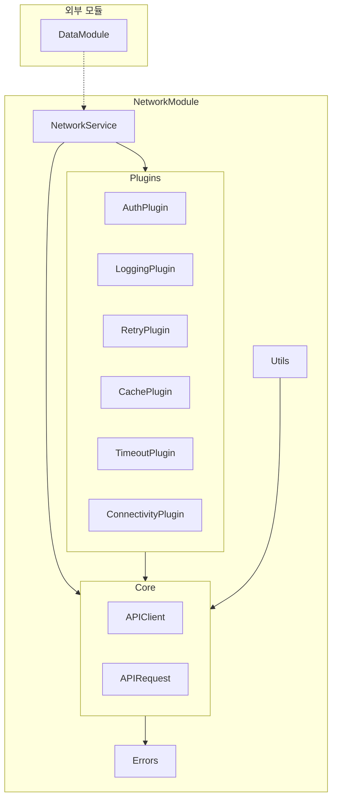

# NetworkModule

## 모듈 개요

NetworkModule은 Toss Bank Clone 애플리케이션의 네트워크 통신을 담당하는 모듈입니다. 백엔드 서버와의 통신, 에러 처리, 캐싱, 로깅, 재시도 등의 네트워크 관련 기능을 제공합니다. 모듈화된 플러그인 시스템을 통해 유연하고 확장 가능한 네트워크 계층을 구현합니다.

## 아키텍처



## 의존성 관계

- **의존하는 모듈**: 없음 (독립적인 모듈)
- **의존받는 모듈**:
  - DataModule: 네트워크 서비스를 사용하여 데이터 요청

## 폴더 구조

```
NetworkModule/
├── Sources/
│   ├── Core/              - 핵심 네트워크 로직
│   │   ├── APIClient.swift
│   │   └── APIRequest.swift
│   ├── Errors/            - 에러 정의 및 처리
│   │   └── NetworkError.swift
│   ├── Plugins/           - 네트워크 기능 확장을 위한 플러그인
│   │   ├── NetworkPlugin.swift
│   │   ├── AuthPlugin.swift
│   │   ├── LoggingPlugin.swift
│   │   ├── RetryPlugin.swift
│   │   ├── CachePlugin.swift
│   │   ├── TimeoutPlugin.swift
│   │   └── ConnectivityPlugin.swift
│   ├── Utils/             - 유틸리티 함수
│   ├── NetworkService.swift  - 메인 네트워크 서비스
│   └── MockNetworkService.swift - 테스트용 모의 서비스
└── Tests/                 - 네트워크 모듈 테스트
    └── NetworkTests/
```

## 주요 컴포넌트

### Core

네트워크 통신의 핵심 구성 요소를 정의합니다.

#### APIRequest

API 요청을 정의하는 프로토콜입니다.

```swift
public protocol APIRequest {
    associatedtype Response: Decodable
    
    var path: String { get }
    var method: HTTPMethod { get }
    var headers: HTTPHeaders? { get }
    var queryParameters: [String: String]? { get }
    var requestBody: RequestBody { get }
    var requiresAuth: Bool { get }
    
    func asURLRequest(baseURL: URL) throws -> URLRequest
}

public extension APIRequest {
    var headers: HTTPHeaders? { return nil }
    var queryParameters: [String: String]? { return nil }
    var requestBody: RequestBody { return .none }
    var requiresAuth: Bool { return true }
    
    func asURLRequest(baseURL: URL) throws -> URLRequest {
        // URLRequest 생성 로직
    }
}
```

#### APIClient

실제 네트워크 요청을 수행하는 클라이언트입니다.

```swift
public protocol APIClient {
    func send<T: APIRequest>(_ request: T) async throws -> T.Response
}

public final class NetworkAPIClient: APIClient {
    private let networkService: NetworkServiceProtocol
    
    public init(networkService: NetworkServiceProtocol) {
        self.networkService = networkService
    }
    
    public func send<T: APIRequest>(_ request: T) async throws -> T.Response {
        return try await networkService.request(request)
    }
}
```

### NetworkService

다양한 플러그인을 조합하여 네트워크 요청을 처리하는 서비스입니다.

```swift
public protocol NetworkServiceProtocol {
    func request<R: APIRequest>(_ apiRequest: R) async throws -> R.Response
    func upload<R: APIRequest>(_ apiRequest: R, data: Data, mimeType: String) async throws -> R.Response
}

public final class NetworkService: NetworkServiceProtocol {
    private let baseURL: URL
    private let session: URLSession
    private let plugins: [NetworkPlugin]
    
    public init(baseURL: URL, 
                session: URLSession = .shared,
                plugins: [NetworkPlugin] = []) {
        self.baseURL = baseURL
        self.session = session
        
        // 기본 플러그인 설정 로직
        var allPlugins = plugins
        // 필요한 기본 플러그인 추가
        self.plugins = allPlugins
    }
    
    public func request<R: APIRequest>(_ apiRequest: R) async throws -> R.Response {
        let urlRequest = try apiRequest.asURLRequest(baseURL: baseURL)
        return try await performRequest(urlRequest)
    }
    
    public func upload<R: APIRequest>(_ apiRequest: R, data: Data, mimeType: String) async throws -> R.Response {
        var urlRequest = try apiRequest.asURLRequest(baseURL: baseURL)
        // 업로드 설정 및 수행
        return try await processResponse(...)
    }
    
    // 내부 구현 메서드들...
}
```

### Plugins

네트워크 기능을 확장하는 플러그인 시스템입니다.

```swift
public protocol NetworkPlugin {
    func prepare(_ request: inout URLRequest) async throws
    func process(_ request: URLRequest, _ response: HTTPURLResponse, _ data: Data) async throws
}
```

주요 플러그인:
- AuthPlugin: 인증 토큰 관리
- LoggingPlugin: 요청/응답 로깅
- RetryPlugin: 실패한 요청 재시도
- CachePlugin: 응답 캐싱
- TimeoutPlugin: 타임아웃 관리
- ConnectivityPlugin: 네트워크 연결 상태 확인

### Errors

네트워크 오류를 정의하고 처리합니다.

```swift
public enum NetworkError: Error {
    case invalidURL
    case invalidResponse
    case httpError(statusCode: Int, data: Data)
    case noInternetConnection
    case connectionError(Error)
    case decodingError(Error)
    case unauthorized
    case serverError
    case unknown(Error)
}
```

## 사용 방법

1. 네트워크 서비스 초기화:

```swift
let baseURL = URL(string: "https://api.example.com")!
let networkService = NetworkService(
    baseURL: baseURL,
    plugins: [
        AuthPlugin(tokenProvider: { return "Bearer token" }),
        RetryPlugin(),
        ConnectivityPlugin()
    ]
)
```

2. API 요청 정의:

```swift
struct UserRequest: APIRequest {
    typealias Response = UserDTO
    
    let userId: String
    
    var path: String { return "/users/\(userId)" }
    var method: HTTPMethod { return .get }
}
```

3. 요청 실행:

```swift
// NetworkService 직접 사용
do {
    let userDTO = try await networkService.request(UserRequest(userId: "123"))
    // userDTO 처리
} catch let error as NetworkError {
    // 네트워크 에러 처리
} catch {
    // 기타 에러 처리
}

// 또는 APIClient 사용
let apiClient = NetworkAPIClient(networkService: networkService)
do {
    let userDTO = try await apiClient.send(UserRequest(userId: "123"))
    // userDTO 처리
} catch {
    // 에러 처리
}
```

## 구현 원리

NetworkModule은 다음 설계 원칙에 따라 구현되었습니다:

1. **모듈성**: 각 네트워크 기능은 독립적인 플러그인으로 구현
2. **확장성**: 새로운 플러그인을 추가하여 기능 확장 가능
3. **테스트 용이성**: 모의 구현(MockNetworkService)을 통한 테스트 지원
4. **에러 처리**: 체계적인 에러 타입과 처리 메커니즘 제공
5. **비동기 처리**: Swift의 최신 async/await 패턴 활용
6. **선언적 API**: APIRequest 프로토콜을 통한 선언적 API 설계

이러한 원칙을 통해 안정적이고 유지보수 가능한 네트워크 계층을 구현할 수 있습니다.