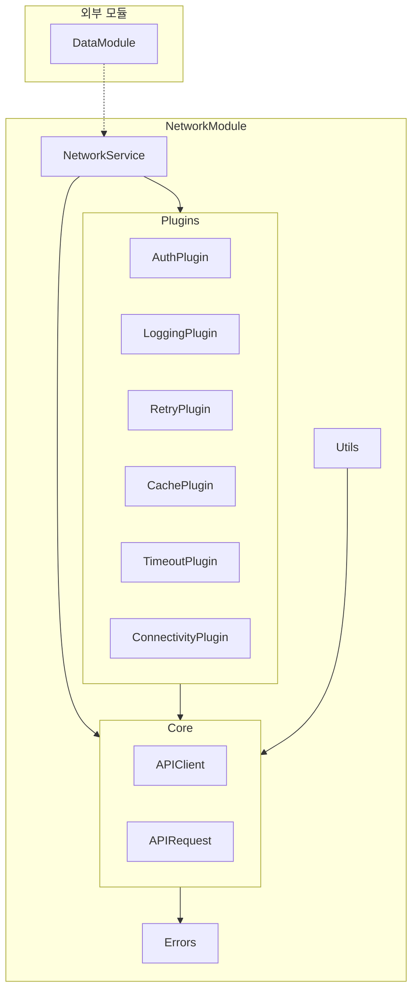

# NetworkModule

## 모듈 개요

NetworkModule은 Toss Bank Clone 애플리케이션의 네트워크 통신을 담당하는 모듈입니다. 백엔드 서버와의 통신, 에러 처리, 캐싱, 로깅, 재시도 등의 네트워크 관련 기능을 제공합니다. 모듈화된 플러그인 시스템을 통해 유연하고 확장 가능한 네트워크 계층을 구현합니다.

## 아키텍처



## 의존성 관계

- **의존하는 모듈**: 없음 (독립적인 모듈)
- **의존받는 모듈**:
  - DataModule: 네트워크 서비스를 사용하여 데이터 요청

## 폴더 구조

```
NetworkModule/
├── Sources/
│   ├── Core/              - 핵심 네트워크 로직
│   │   ├── APIClient.swift
│   │   └── APIRequest.swift
│   ├── Errors/            - 에러 정의 및 처리
│   │   └── NetworkError.swift
│   ├── Plugins/           - 네트워크 기능 확장을 위한 플러그인
│   │   ├── NetworkPlugin.swift
│   │   ├── AuthPlugin.swift
│   │   ├── LoggingPlugin.swift
│   │   ├── RetryPlugin.swift
│   │   ├── CachePlugin.swift
│   │   ├── TimeoutPlugin.swift
│   │   └── ConnectivityPlugin.swift
│   ├── Utils/             - 유틸리티 함수
│   ├── NetworkService.swift  - 메인 네트워크 서비스
│   └── MockNetworkService.swift - 테스트용 모의 서비스
└── Tests/                 - 네트워크 모듈 테스트
    └── NetworkTests/
```

## 주요 컴포넌트

### Core

네트워크 통신의 핵심 구성 요소를 정의합니다.

#### APIRequest

API 요청을 정의하는 프로토콜입니다.

```swift
protocol APIRequest {
    associatedtype Response: Decodable
    
    var path: String { get }
    var method: HTTPMethod { get }
    var headers: [String: String]? { get }
    var queryParameters: [String: String]? { get }
    var body: Data? { get }
}

extension APIRequest {
    var headers: [String: String]? { return nil }
    var queryParameters: [String: String]? { return nil }
    var body: Data? { return nil }
}
```

#### APIClient

실제 네트워크 요청을 수행하는 클라이언트입니다.

```swift
class APIClient {
    private let baseURL: URL
    private let session: URLSession
    
    init(baseURL: URL, session: URLSession = .shared) {
        self.baseURL = baseURL
        self.session = session
    }
    
    func request<T: APIRequest>(_ request: T) async throws -> T.Response {
        // 네트워크 요청 구현
    }
}
```

### NetworkService

다양한 플러그인을 조합하여 네트워크 요청을 처리하는 서비스입니다.

```swift
class NetworkService {
    private let apiClient: APIClient
    private let plugins: [NetworkPlugin]
    
    init(baseURL: URL, plugins: [NetworkPlugin] = []) {
        self.apiClient = APIClient(baseURL: baseURL)
        self.plugins = plugins
    }
    
    func request<T: APIRequest>(_ request: T) async throws -> T.Response {
        // 플러그인을 통한 요청 전처리
        var modifiedRequest = request
        for plugin in plugins {
            modifiedRequest = try await plugin.prepare(request: modifiedRequest)
        }
        
        // 실제 요청 수행
        do {
            let response = try await apiClient.request(modifiedRequest)
            
            // 플러그인을 통한 응답 후처리
            var processedResponse = response
            for plugin in plugins {
                processedResponse = try await plugin.process(response: processedResponse, for: modifiedRequest)
            }
            
            return processedResponse
        } catch {
            // 플러그인을 통한 에러 처리
            var processedError = error
            for plugin in plugins {
                processedError = try await plugin.handle(error: processedError, for: modifiedRequest)
            }
            throw processedError
        }
    }
}
```

### Plugins

네트워크 기능을 확장하는 플러그인 시스템입니다.

```swift
protocol NetworkPlugin {
    func prepare<T: APIRequest>(request: T) async throws -> T
    func process<T: APIRequest>(response: T.Response, for request: T) async throws -> T.Response
    func handle<T: APIRequest>(error: Error, for request: T) async throws -> Error
}

// 기본 구현 제공
extension NetworkPlugin {
    func prepare<T: APIRequest>(request: T) async throws -> T { return request }
    func process<T: APIRequest>(response: T.Response, for request: T) async throws -> T.Response { return response }
    func handle<T: APIRequest>(error: Error, for request: T) async throws -> Error { return error }
}
```

주요 플러그인:
- AuthPlugin: 인증 토큰 관리
- LoggingPlugin: 요청/응답 로깅
- RetryPlugin: 실패한 요청 재시도
- CachePlugin: 응답 캐싱
- TimeoutPlugin: 타임아웃 관리
- ConnectivityPlugin: 네트워크 연결 상태 확인

### Errors

네트워크 오류를 정의하고 처리합니다.

```swift
enum NetworkError: Error {
    case invalidRequest
    case invalidResponse
    case httpError(statusCode: Int, data: Data?)
    case connectionError
    case decodingError(Error)
    case unauthorized
    case timeout
    case serverError
    case unknown(Error)
}
```

## 사용 방법

1. 네트워크 서비스 초기화:

```swift
let baseURL = URL(string: "https://api.example.com")!
let networkService = NetworkService(
    baseURL: baseURL,
    plugins: [
        AuthPlugin(tokenProvider: tokenProvider),
        LoggingPlugin(),
        RetryPlugin(maxRetries: 3),
        CachePlugin(),
        TimeoutPlugin(timeout: 30),
        ConnectivityPlugin()
    ]
)
```

2. API 요청 정의:

```swift
enum UserAPIRequest {
    case getUser(id: String)
}

extension UserAPIRequest: APIRequest {
    typealias Response = UserDTO
    
    var path: String {
        switch self {
        case .getUser(let id):
            return "/users/\(id)"
        }
    }
    
    var method: HTTPMethod {
        return .get
    }
}
```

3. 요청 실행:

```swift
do {
    let userDTO = try await networkService.request(UserAPIRequest.getUser(id: "123"))
    // userDTO 처리
} catch let error as NetworkError {
    // 네트워크 에러 처리
} catch {
    // 기타 에러 처리
}
```

## 구현 원리

NetworkModule은 다음 설계 원칙에 따라 구현되었습니다:

1. **모듈성**: 각 네트워크 기능은 독립적인 플러그인으로 구현
2. **확장성**: 새로운 플러그인을 추가하여 기능 확장 가능
3. **테스트 용이성**: 모의 구현(MockNetworkService)을 통한 테스트 지원
4. **에러 처리**: 체계적인 에러 타입과 처리 메커니즘 제공
5. **비동기 처리**: Swift의 최신 async/await 패턴 활용

이러한 원칙을 통해 안정적이고 유지보수 가능한 네트워크 계층을 구현할 수 있습니다.