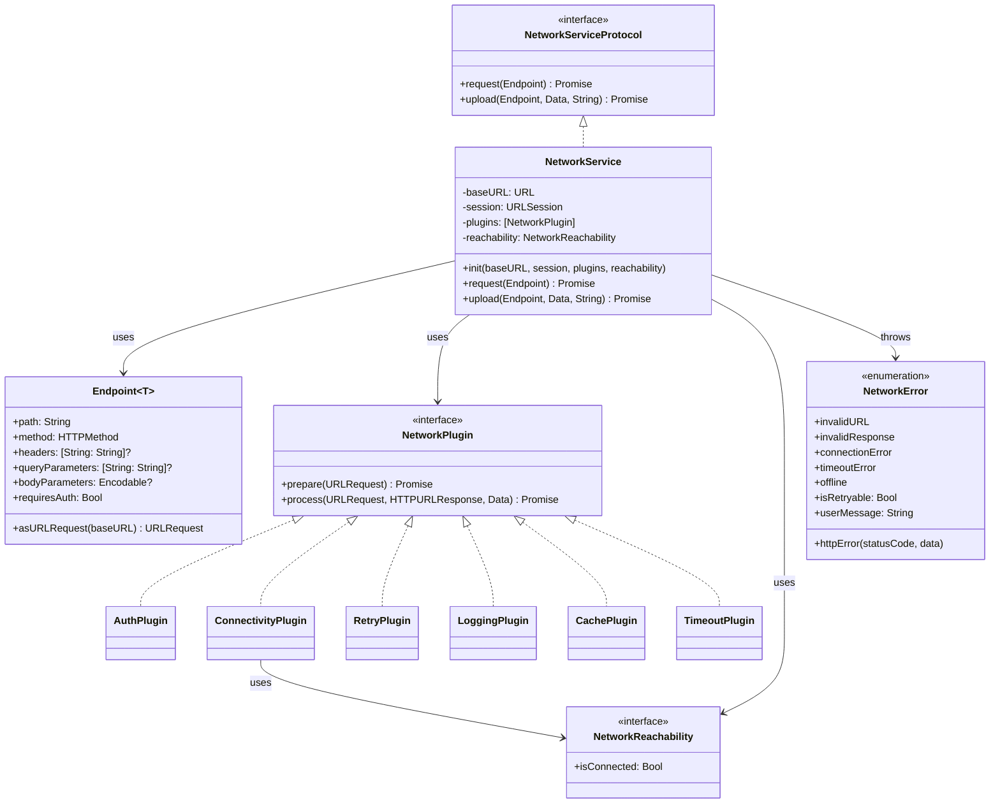
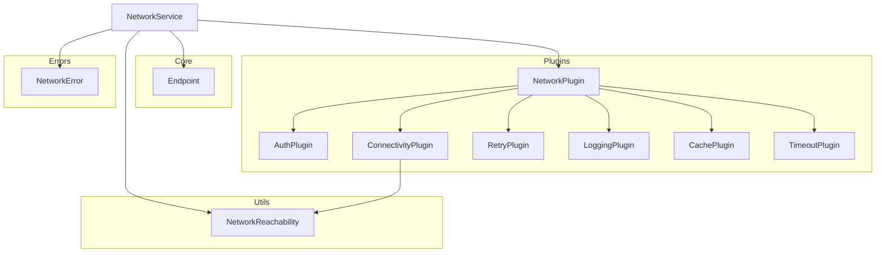

# NetworkModule

NetworkModule은 iOS 앱에서 네트워크 요청을 쉽고 유연하게 처리할 수 있는 모듈입니다. 플러그인 기반 아키텍처를 통해 확장성이 뛰어나며, 다양한 네트워크 요청 시나리오에 대응할 수 있습니다.

## 특징

- ✅ **Swift Concurrency** 지원 (`async/await`)
- ✅ 유연한 **플러그인 시스템**
- ✅ 타입 안전한 **제네릭 API 엔드포인트**
- ✅ 자동 **재시도 메커니즘**
- ✅ **인증 토큰** 관리
- ✅ 네트워크 **연결 상태** 처리
- ✅ **로깅** 및 **캐싱** 지원
- ✅ **업로드** 기능 지원

## 폴더 구조

```
NetworkModule/
├── Sources/
│   ├── Core/                 # 핵심 API 인터페이스
│   │   ├── Endpoint.swift    # 타입 안전한 엔드포인트 정의
│   │   └── APIRequest.swift  # 기본 API 요청 인터페이스
│   ├── Plugins/              # 네트워크 플러그인
│   │   ├── NetworkPlugin.swift     # 플러그인 인터페이스
│   │   ├── AuthPlugin.swift        # 인증 토큰 처리
│   │   ├── ConnectivityPlugin.swift # 네트워크 연결 확인
│   │   ├── RetryPlugin.swift       # 재시도 메커니즘
│   │   ├── LoggingPlugin.swift     # 로깅
│   │   ├── CachePlugin.swift       # 캐싱
│   │   └── TimeoutPlugin.swift     # 타임아웃 관리
│   ├── Errors/               # 오류 정의
│   │   └── NetworkError.swift      # 네트워크 오류 열거형
│   ├── Utils/                # 유틸리티 클래스
│   │   └── NetworkReachability.swift # 네트워크 연결 상태 관리
│   ├── API/                  # API 관련 클래스
│   └── NetworkService.swift  # 주요 네트워크 서비스 클래스
└── Tests/                    # 테스트 코드
    └── NetworkTests/         # 단위 및 통합 테스트
```

## 아키텍처



## 의존성 관계



## 사용 예제

### 기본 사용법

```swift
// NetworkService 인스턴스 생성
let baseURL = URL(string: "https://api.example.com")!
let networkService = NetworkService(baseURL: baseURL)

// 엔드포인트 정의
struct User: Decodable {
    let id: Int
    let name: String
    let email: String
}

let userEndpoint = Endpoint<User>(path: "/users/1")

// 비동기 요청 수행
do {
    let user = try await networkService.request(userEndpoint)
    print("사용자 정보: \(user.name), \(user.email)")
} catch {
    print("오류 발생: \(error)")
}
```

### 플러그인 추가

```swift
// 로깅 플러그인 추가
let loggingPlugin = LoggingPlugin()

// 재시도 플러그인 추가 (최대 3회 재시도, 지수 백오프 적용)
let retryPlugin = RetryPlugin()

// 인증 토큰 제공자 설정
let authTokenProvider = { return KeychainService.getToken() }

// 서비스 생성 시 플러그인 추가
let networkService = NetworkService(
    baseURL: baseURL,
    authTokenProvider: authTokenProvider,
    plugins: [loggingPlugin, retryPlugin]
)
```

### 파일 업로드

```swift
// 이미지 데이터 준비
let imageData = UIImage(named: "profile")?.jpegData(compressionQuality: 0.8) ?? Data()

// 업로드 엔드포인트 정의
let uploadEndpoint = Endpoint<UploadResponse>(path: "/upload", method: .post)

// 업로드 요청
do {
    let response = try await networkService.upload(
        to: uploadEndpoint, 
        data: imageData, 
        mimeType: "image/jpeg"
    )
    print("업로드 완료: \(response)")
} catch {
    print("업로드 실패: \(error)")
}
```

### 고급 엔드포인트 설정

```swift
// 메서드 체이닝을 통한 엔드포인트 설정
let searchEndpoint = Endpoint<SearchResults>(path: "/search")
    .method(.get)
    .queryParameters([
        "q": "Swift",
        "page": "1",
        "limit": "20"
    ])
    .headers([
        "X-API-Key": "your-api-key"
    ])
    .timeout(60.0)
    .cachePolicy(.returnCacheDataElseLoad)

// 요청 수행
let results = try await networkService.request(searchEndpoint)
```

### POST 요청 보내기

```swift
// 요청 바디 모델
struct CreateUserRequest: Encodable {
    let name: String
    let email: String
    let age: Int
}

// POST 엔드포인트 설정
let createUserEndpoint = Endpoint<User>(path: "/users", method: .post)
    .body(CreateUserRequest(
        name: "홍길동",
        email: "hong@example.com",
        age: 30
    ))

// 요청 수행
let newUser = try await networkService.request(createUserEndpoint)
```

## 커스텀 플러그인 만들기

NetworkPlugin 프로토콜을 구현하여 자신만의 플러그인을 만들 수 있습니다:

```swift
class MyCustomPlugin: NetworkPlugin {
    func prepare(_ request: inout URLRequest) async throws {
        // 요청 전처리 로직
        request.setValue("Custom-Value", forHTTPHeaderField: "X-Custom-Header")
    }
    
    func process(_ request: URLRequest, _ response: HTTPURLResponse, _ data: Data) async throws {
        // 응답 후처리 로직
        guard response.statusCode != 403 else {
            throw NetworkError.unauthorized
        }
    }
}

// 플러그인 사용
let networkService = NetworkService(
    baseURL: baseURL,
    plugins: [MyCustomPlugin()]
)
```

## 테스트

NetworkModule은 종합적인 테스트 슈트를 제공합니다:

- `NetworkServiceTests`: 기본 요청 및 업로드 기능 테스트
- `EndpointTests`: 엔드포인트 생성 및 구성 테스트
- `RetryPluginTests`: 재시도 메커니즘 테스트
- `NetworkPluginTests`: 다양한 플러그인 테스트
- `NetworkModuleIntegrationTests`: 모듈 통합 테스트

## 라이센스

이 라이브러리는 MIT 라이센스 하에 사용할 수 있습니다. 