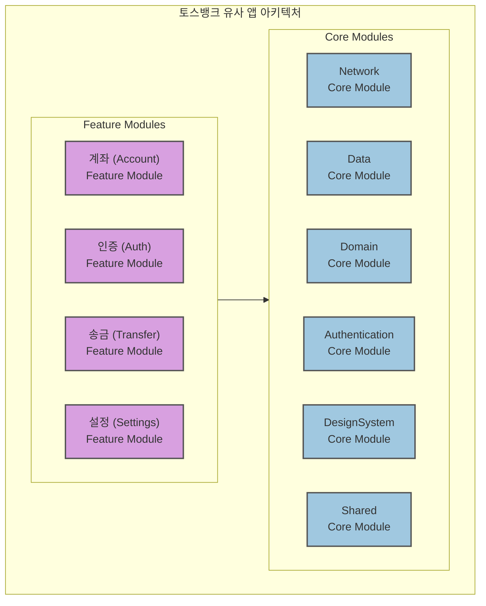
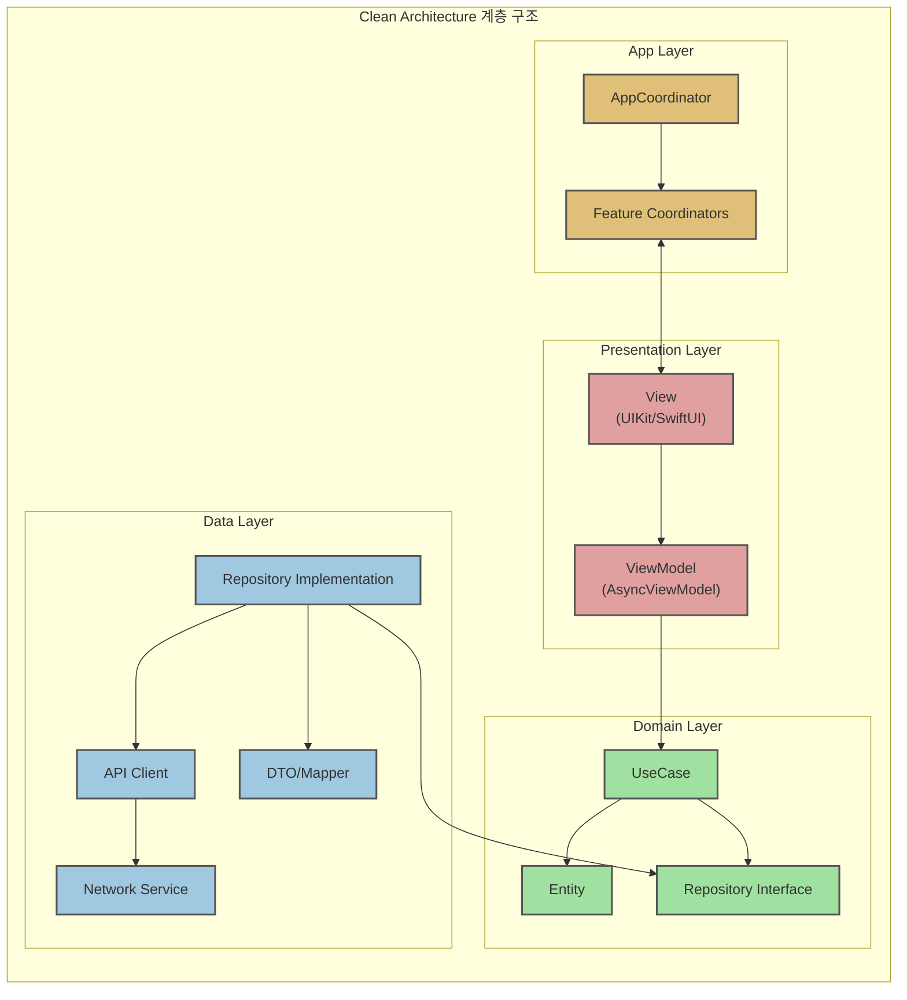
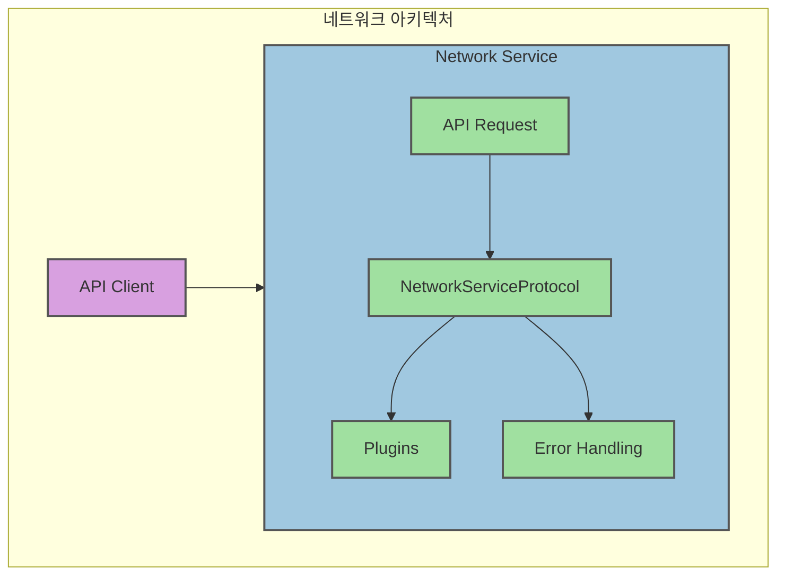
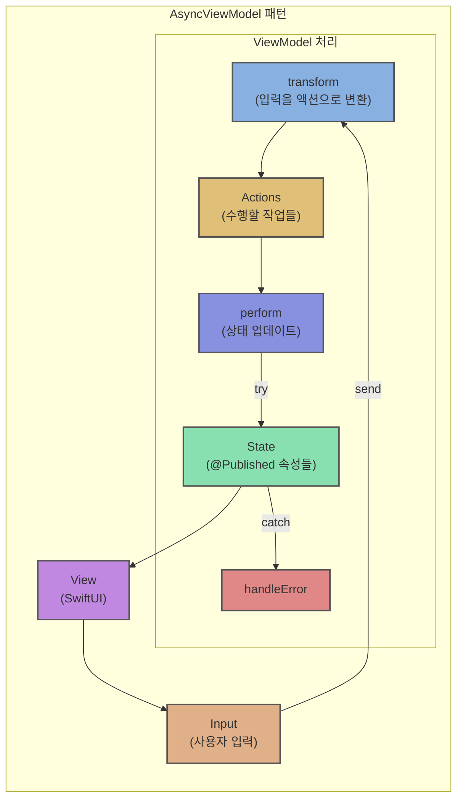

# TossBankClone

토스뱅크 애플리케이션을 모방한 iOS 앱 프로젝트입니다. Clean Architecture와 모듈식 구조를 통해 확장성과 유지보수성이 높은 코드베이스를 제공합니다.

https://github.com/user-attachments/assets/b9f856cf-d104-4333-b94f-ebd2addf1563

## 목차
- [프로젝트 개요](#프로젝트-개요)
- [아키텍처](#아키텍처)
  - [계층 구조 (Clean Architecture)](#계층-구조-clean-architecture)
- [모듈 구성](#모듈-구성)
  - [코어 모듈](#코어-모듈)
  - [기능 모듈](#기능-모듈)
  - [모듈 간 의존성](#모듈-간-의존성)
- [핵심 패턴](#핵심-패턴)
  - [네트워크 아키텍처](#네트워크-아키텍처)
  - [상태 관리 (AsyncViewModel)](#상태-관리-asyncviewmodel)
  - [의존성 관리](#의존성-관리)
- [주요 기능](#주요-기능)
- [기술 스택](#기술-스택)
- [개발 환경 설정](#개발-환경-설정)
- [폴더 구조](#폴더-구조)
- [테스트 전략](#테스트-전략)
- [확장성 고려사항](#확장성-고려사항)

## 프로젝트 개요

이 프로젝트는 토스뱅크의 주요 기능을 구현한 iOS 앱으로, Clean Architecture 원칙에 따라 코드를 모듈화하여 구성했습니다. 

각 모듈은 명확한 책임을 가지며, 모듈 간 의존성을 최소화하여 변경에 유연하게 대응할 수 있습니다. 

토스뱅크의 기술 스택(Multi-module App, Micro Feature Architecture)을 참고하여 설계되었습니다.

## 아키텍처

이 프로젝트는 Clean Architecture와 MVVM 패턴을 결합한 구조를 채택하고 있습니다.

### 아키텍처 다이어그램



### 계층 구조 (Clean Architecture)



#### Clean Architecture 계층 설명

- **App Layer**: 앱의 전체 흐름과 화면 간 네비게이션을 관리
  - **AppCoordinator**: 앱의 최상위 Coordinator로 전체 화면 흐름 관리
  - **Feature Coordinators**: 각 기능별 Coordinator로 해당 기능 내 화면 흐름 관리

- **Presentation Layer**: 사용자 인터페이스와 상호작용 담당
  - **View**: UI 컴포넌트 (SwiftUI, 일부 UIKit)
  - **ViewModel**: 비동기 상태 관리 (AsyncViewModel 패턴)

- **Domain Layer**: 비즈니스 로직과 규칙 정의
  - **UseCase**: 비즈니스 로직 및 유스케이스
  - **Entity**: 핵심 도메인 모델
  - **Repository Interface**: 데이터 액세스를 위한 인터페이스
  - 외부 의존성 없는 순수한 비즈니스 로직 계층

- **Data Layer**: 데이터 액세스 및 저장 담당
  - **Repository Implementation**: 리포지토리 인터페이스 구현
  - **API Client**: 네트워크 서비스를 사용한 API 요청 처리
  - **DTO/Mapper**: 데이터 변환 및 매핑
  - **Network Service**: APIRequest 기반 네트워크 통신 처리

#### 계층 간 의존성 관계

- **App Layer → Presentation Layer**: App Layer는 화면 생성 및 전환을 위해 Presentation Layer에 의존합니다.
- **App Layer → Domain Layer**: App Layer는 비즈니스 로직 실행을 위해 Domain Layer에 의존합니다.
- **Presentation Layer → Domain Layer**: Presentation Layer는 상태 관리 및 비즈니스 로직 접근을 위해 Domain Layer에 의존합니다.
  - **ViewModel → UseCase**: ViewModel은 UseCase를 통해 비즈니스 로직을 실행합니다.
  - **ViewModel → Entity**: ViewModel은 화면에 표시할 도메인 모델(Entity)을 참조합니다.

- **Data Layer → Domain Layer**: Data Layer는 Repository Interface 구현을 위해 Domain Layer에 의존합니다.
  - **Repository Implementation → Repository Interface**: Data Layer의 Repository 구현체는 Domain Layer에 정의된 Repository 인터페이스를 구현합니다.
  - **Repository Implementation → Entity**: Repository 구현체는 DTO를 도메인 Entity로 변환하여 반환합니다.

#### Clean Architecture 의존성 원칙

1. **의존성 방향**: 의존성은 항상 바깥쪽 계층에서 안쪽 계층으로 향합니다(Dependency Rule).
   - Domain Layer는 어떤 계층에도 의존하지 않습니다(가장 독립적).
   - Data Layer와 Presentation Layer는 Domain Layer에 의존합니다.
   - Data Layer와 Presentation Layer는 서로 의존하지 않습니다.

2. **의존성 역전 원칙(DIP)**: Domain Layer는 Repository 인터페이스를 정의하고, Data Layer는 이를 구현함으로써 의존성이 역전됩니다.
   - Domain Layer는 구체적인 데이터 소스를 알지 못합니다.
   - UseCase는 Repository 인터페이스만 알고 있으며, 실제 구현이 어떻게 되어있는지 모릅니다.

3. **데이터 흐름**:
   - **Presentation → Domain → Data**: 요청 흐름 (View → ViewModel → UseCase → Repository Interface → Repository Implementation)
   - **Data → Domain → Presentation**: 응답 흐름 (Repository Implementation → Entity → UseCase → ViewModel → View)

4. **계층 간 경계 객체**:
   - **Domain과 Presentation 경계**: Entity, Repository Interface, UseCase
   - **Domain과 Data 경계**: Repository Interface, Entity

## 모듈 구성

### 코어 모듈

- **DomainModule**: 
  - 비즈니스 엔티티 정의
  - 리포지토리 인터페이스 정의
  - 유스케이스 구현
  - 외부 의존성 없는 순수한 비즈니스 로직

- **DataModule**: 
  - 리포지토리 구현체
  - DTO(Data Transfer Objects)
  - API 요청 정의
  - 도메인 모델과 데이터 소스 간 변환

- **NetworkModule**: 
  - 네트워크 통신 인프라
  - APIRequest 및 APIClient 추상화
  - 플러그인 기반 확장 가능한 구조
  - 에러 처리 및 응답 파싱

- **AuthenticationModule**: 
  - 인증 관련 핵심 기능
  - 토큰 관리 및 인증 상태 처리

- **SharedModule**: 
  - 코디네이터 기반 네비게이션
  - 의존성 주입 컨테이너
  - AsyncViewModel 패턴 구현
  - 알림 관리 시스템

- **DesignSystem**: 
  - UI 컴포넌트 라이브러리
  - 색상 시스템 및 테마
  - 타이포그래피 및 애니메이션
  - 재사용 가능한 UI 요소

### 기능 모듈

각 기능별 독립적인 모듈:
- **Account**: 계좌 조회 및 관리 기능
- **Auth**: 인증 및 보안 관련 기능
- **Transfer**: 송금 및 이체 기능
- **Settings**: 앱 설정 기능

각 기능 모듈은 다음과 같은 구조를 가집니다:
- **Coordinators**: 화면 전환 및 네비게이션 관리
- **DIContainer**: 의존성 주입 컨테이너
- **Presentation**: 화면(Views)과 뷰모델(ViewModels) 구현

### 모듈 간 의존성

```
App
 ├── DomainModule
 ├── DataModule
 │    └── DomainModule
 ├── NetworkModule
 ├── AuthenticationModule
 │    └── DomainModule
 ├── SharedModule
 ├── DesignSystem
 └── Features
      ├── Account
      │    ├── DomainModule
      │    ├── DataModule
      │    ├── NetworkModule
      │    ├── SharedModule
      │    └── DesignSystem
      ├── Auth
      │    ├── DomainModule
      │    ├── AuthenticationModule
      │    ├── SharedModule
      │    └── DesignSystem
      ├── Transfer
      │    ├── DomainModule
      │    ├── DataModule
      │    ├── NetworkModule
      │    ├── SharedModule
      │    └── DesignSystem
      └── Settings
           ├── DomainModule
           ├── SharedModule
           └── DesignSystem
```

## 핵심 패턴

### 네트워크 아키텍처

#### 네트워크 서비스 구조



#### 구성 요소

- **NetworkServiceProtocol**: 네트워크 서비스 인터페이스 정의
  ```swift
  public protocol NetworkServiceProtocol {
      func request<R: APIRequest>(_ apiRequest: R) async throws -> R.Response
      func upload<R: APIRequest>(_ apiRequest: R, data: Data, mimeType: String) async throws -> R.Response
  }
  ```

- **NetworkService**: 실제 네트워크 요청 처리 구현체
  ```swift
  public final class NetworkService: NetworkServiceProtocol {
      private let baseURL: URL
      private let session: URLSession
      private let plugins: [NetworkPlugin]
      
      // 요청 처리 메서드
      public func request<R: APIRequest>(_ apiRequest: R) async throws -> R.Response {
          let urlRequest = try apiRequest.asURLRequest(baseURL: baseURL)
          return try await performRequest(urlRequest)
      }
  }
  ```

- **APIRequest**: API 요청 추상화
  ```swift
  public protocol APIRequest {
      associatedtype Response: Decodable
      var path: String { get }
      var method: HTTPMethod { get }
      var headers: HTTPHeaders? { get }
      var queryParameters: [String: String]? { get }
      var requestBody: RequestBody { get }
      var requiresAuth: Bool { get }
      
      func asURLRequest(baseURL: URL) throws -> URLRequest
  }
  ```

- **APIClient**: 도메인별 API 요청 간소화
  ```swift
  public protocol APIClient {
      func send<T: APIRequest>(_ request: T) async throws -> T.Response
  }
  
  public final class NetworkAPIClient: APIClient {
      private let networkService: NetworkServiceProtocol
      
      public func send<T: APIRequest>(_ request: T) async throws -> T.Response {
          return try await networkService.request(request)
      }
  }
  ```

- **플러그인 시스템**: 네트워크 기능 확장
  ```swift
  public protocol NetworkPlugin {
      func prepare(_ request: inout URLRequest) async throws
      func process(_ request: URLRequest, _ response: HTTPURLResponse, _ data: Data) async throws
  }
  ```

#### 주요 플러그인
- **AuthPlugin**: 인증 토큰 관리
- **RetryPlugin**: 실패한 요청 자동 재시도
- **ConnectivityPlugin**: 네트워크 연결 확인
- **LoggingPlugin**: 요청/응답 로깅

### 상태 관리 (AsyncViewModel)

AsyncViewModel은 비동기 작업을 효율적으로 처리하는 MVVM 기반 상태 관리 패턴으로, Swift의 async/await 기능과 Combine의 @Published를 활용합니다.



#### AsyncViewModel 구현

```swift
@MainActor
protocol AsyncViewModel: ObservableObject {
    associatedtype Input
    associatedtype Action
    
    /// 사용자 입력을 액션으로 변환
    nonisolated func transform(_ input: Input) async throws -> [Action]
    
    /// 액션을 수행하여 상태 업데이트
    func perform(_ action: Action) async throws
    
    /// 에러 처리
    func handleError(_ error: Error) async
    
    /// 입력 전송 메서드 (기본 구현 제공)
    func send(_ input: Input)
}

extension AsyncViewModel {
    func send(_ input: Input) {
        Task {
            do {
                let actions = try await transform(input)
                for action in actions {
                    try await perform(action)
                }
            } catch {
                await handleError(error)
            }
        }
    }
}
```

#### 사용 예시

```swift
final class AccountListViewModel: AsyncViewModel {
    // 입력 타입 정의
    enum Input {
        case loadAccounts
        case refreshAccounts
        case selectAccount(id: String)
    }
    
    // 액션 타입 정의
    enum Action {
        case fetchAccounts
        case updateAccountList
        case navigateToDetail(id: String)
    }
    
    // 뷰모델 상태 (@Published 속성)
    @Published var accounts: [Account] = []
    @Published var isLoading = false
    @Published var errorMessage: String?
    
    private let accountRepository: AccountRepository
    var onAccountSelected: ((String) -> Void)?
    
    init(accountRepository: AccountRepository) {
        self.accountRepository = accountRepository
    }
    
    // 입력을 액션으로 변환 (비동기 처리)
    nonisolated func transform(_ input: Input) async throws -> [Action] {
        switch input {
        case .loadAccounts:
            return [.fetchAccounts]
        case .refreshAccounts:
            return [.fetchAccounts, .updateAccountList]
        case .selectAccount(let id):
            return [.navigateToDetail(id: id)]
        }
    }
    
    // 액션 수행 및 상태 업데이트
    func perform(_ action: Action) async throws {
        switch action {
        case .fetchAccounts:
            isLoading = true
            defer { isLoading = false }
            accounts = try await accountRepository.getAccounts()
        case .updateAccountList:
            // 추가 업데이트 로직
            break
        case .navigateToDetail(let id):
            onAccountSelected?(id)
        }
    }
    
    // 에러 처리
    func handleError(_ error: Error) async {
        errorMessage = error.localizedDescription
    }
}
```

#### SwiftUI에서의 사용

```swift
struct AccountListView: View {
    @StateObject var viewModel: AccountListViewModel
    
    var body: some View {
        List(viewModel.accounts) { account in
            AccountRow(account: account)
                .onTapGesture {
                    viewModel.send(.selectAccount(id: account.id))
                }
        }
        .onAppear {
            viewModel.send(.loadAccounts)
        }
        .refreshable {
            viewModel.send(.refreshAccounts)
        }
    }
}
```

#### 장점
- **비동기 처리**: Swift Concurrency를 활용한 효율적인 비동기 작업 처리
- **단방향 데이터 흐름**: 입력 → 변환 → 액션 → 상태 변경의 명확한 흐름
- **관심사 분리**: 입력 처리, 비즈니스 로직, 상태 관리, 에러 처리가 명확히 분리
- **상태 일관성**: @Published 속성을 통한 일관된 상태 관리와 UI 자동 업데이트
- **테스트 용이성**: 비동기 코드의 단위 테스트 용이성 제공

### 의존성 관리

#### DIContainer 패턴

```swift
// 프로토콜 정의
public protocol AccountDIContainerProtocol {
    func makeAccountListViewModel() -> AccountListViewModel
    func makeAccountDetailViewModel(accountId: String) -> AccountDetailViewModel
}

// 구현체
public final class AccountDIContainer: AccountDIContainerProtocol {
    private let environment: AppEnvironment
    private let networkService: NetworkServiceProtocol
    
    public init(environment: AppEnvironment, networkService: NetworkServiceProtocol) {
        self.environment = environment
        self.networkService = networkService
    }
    
    private func createAPIClient() -> APIClient {
        return NetworkAPIClient(networkService: networkService)
    }
    
    private func createAccountRepository() -> AccountRepositoryProtocol {
        return AccountRepositoryImpl(apiClient: createAPIClient())
    }
    
    public func makeAccountListViewModel() -> AccountListViewModel {
        return AccountListViewModel(repository: createAccountRepository())
    }
    
    public func makeAccountDetailViewModel(accountId: String) -> AccountDetailViewModel {
        return AccountDetailViewModel(
            accountId: accountId,
            repository: createAccountRepository()
        )
    }
}
```

#### 모듈 간 의존성 규칙
- 도메인 모듈은 어떤 모듈에도 의존하지 않음
- 데이터 모듈은 도메인 모듈에만 의존
- 기능 모듈은 필요한 코어 모듈에만 의존
- 기능 모듈 간에는 직접적인 의존성 없음

## 주요 기능

### 계좌 관리
- 계좌 목록 조회
- 계좌 상세 정보 확인
- 거래 내역 조회

### 인증
- PIN 로그인
- 생체 인증(Face ID/Touch ID)
- 보안 기능(화면 캡처 방지, 타임아웃)

### 송금
- 계좌 간 이체
- 수취인 관리
- 이체 내역 관리

### 설정
- 앱 설정 관리
- 사용자 프로필 관리
- 알림 설정

## 기술 스택

- **언어**: Swift 5.9+
- **UI 프레임워크**: SwiftUI, UIKit(일부 화면)
- **아키텍처**: Clean Architecture + MVVM
- **네비게이션**: Coordinator 패턴
- **비동기 프로그래밍**: Swift Concurrency(async/await)
- **반응형 프로그래밍**: Combine
- **네트워크**: 모듈화된 플러그인 기반 네트워크 계층
- **로컬 데이터베이스**: SwiftData
- **의존성 관리**: Tuist
- **보안**: KeyChain, LocalAuthentication

## 개발 환경 설정

### 요구사항
- iOS 17.0+
- Xcode 15.0+
- Swift 5.9+
- Tuist

### 설치 방법

1. 저장소 클론
```bash
git clone https://github.com/Jimmy-Jung/TossBankClone/edit/main/README.md
cd TossBankClone
```

2. Tuist 설치 (없는 경우)
```bash
curl -Ls https://install.tuist.io | bash
```

3. 프로젝트 생성
```bash
tuist generate
```

4. Xcode에서 프로젝트 열기
```bash
open App/TossBankClone.xcworkspace
```

## 폴더 구조

```
App/
├── Project.swift                # Tuist 프로젝트 설정
├── TossBankClone/               # 앱 메인 타겟
├── Modules/                     # 모듈 디렉토리
│   ├── DomainModule/            # 도메인 레이어
│   │   └── Sources/
│   │       ├── Entities/        # 도메인 모델
│   │       ├── Repositories/    # 리포지토리 인터페이스
│   │       └── UseCases/        # 비즈니스 로직
│   ├── DataModule/              # 데이터 레이어
│   │   └── Sources/
│   │       ├── APIRequests/     # API 요청 정의
│   │       ├── DTOs/            # 데이터 전송 객체
│   │       └── Repositories/    # 리포지토리 구현
│   ├── NetworkModule/           # 네트워크 레이어
│   │   └── Sources/
│   │       ├── Core/            # 핵심 네트워크 로직 (APIClient, APIRequest)
│   │       ├── Plugins/         # 네트워크 플러그인 (Auth, Retry, Connectivity 등)
│   │       ├── Errors/          # 에러 정의
│   │       └── Utils/           # 유틸리티 함수
│   ├── AuthenticationModule/    # 인증 모듈
│   │   └── Sources/
│   │       └── Manager/         # 인증 관리자
│   ├── SharedModule/            # 공유 기능 모듈
│   │   └── Sources/
│   │       ├── Coordinator/     # 네비게이션 관리
│   │       ├── DIContainer/     # 의존성 주입
│   │       ├── AsyncViewModel/  # 비동기 뷰모델 패턴
│   │       └── Notification/    # 알림 관리
│   ├── DesignSystem/            # 디자인 시스템
│   │   ├── Resources/           # 디자인 리소스
│   │   └── Sources/
│   │       ├── Theme/           # 테마 정의
│   │       └── Components/      # UI 컴포넌트
│   └── Features/                # 기능 모듈
│       ├── Account/             # 계좌 기능
│       │   └── Sources/
│       │       ├── Coordinators/  # 화면 조정
│       │       ├── DIContainer/   # 의존성 주입
│       │       └── Presentation/  # 화면 및 뷰모델
│       ├── Auth/                # 인증 기능
│       │   └── Sources/
│       │       ├── Coordinators/
│       │       ├── DIContainer/
│       │       └── Presentation/
│       ├── Transfer/            # 송금 기능
│       │   └── Sources/
│       │       ├── Coordinators/
│       │       ├── DIContainer/
│       │       └── Presentation/
│       └── Settings/            # 설정 기능
│           └── Sources/
│               ├── Coordinators/
│               ├── DIContainer/
│               └── Presentation/
└── Tests/                       # 테스트 디렉토리
    ├── UnitTests/
    ├── IntegrationTests/
    └── UITests/
```

## 테스트 전략

### 테스트 계층
- **단위 테스트**: 비즈니스 로직 및 유스케이스 검증
- **통합 테스트**: 모듈 간 연동 검증
- **UI 테스트**: 사용자 흐름 및 인터페이스 검증

### 테스트 용이성
- 인터페이스와 실제 구현 분리로 단위 테스트 용이
- Mock 네트워크 서비스 제공
  ```swift
  public final class MockNetworkService: NetworkServiceProtocol {
      public func request<R: APIRequest>(_ apiRequest: R) async throws -> R.Response {
          // Mock 응답 구현
      }
  }
  ```
- DIContainer를 통한 테스트 환경 설정 용이

## 확장성 고려사항

### 신규 기능 추가
- 새로운 기능은 독립적인 Feature 모듈로 추가
- 공통 기능은 Core 모듈로 추출하여 재사용
- 필요한 의존성만 주입받는 구조로 결합도 최소화

### UI/UX 변경
- DesignSystem을 통한 일관된 UI 컴포넌트 관리
- 테마 및 스타일 중앙 관리로 일괄 변경 용이

각 모듈에는 자체 README.md 파일이 있어 해당 모듈의 상세 정보, 아키텍처, 사용 방법 등을 확인할 수 있습니다.
