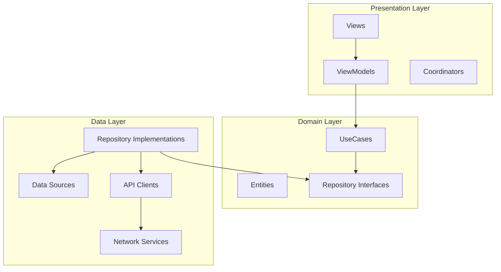

# TossBankClone

토스뱅크 애플리케이션을 모방한 iOS 앱 프로젝트입니다. Clean Architecture와 모듈식 구조를 통해 확장성과 유지보수성이 높은 코드베이스를 제공합니다.

## 목차
- [프로젝트 개요](#프로젝트-개요)
- [아키텍처](#아키텍처)
- [모듈 구성](#모듈-구성)
- [주요 기능](#주요-기능)
- [기술 스택](#기술-스택)
- [개발 환경 설정](#개발-환경-설정)
- [폴더 구조](#폴더-구조)

## 프로젝트 개요

이 프로젝트는 토스뱅크의 주요 기능을 구현한 iOS 앱으로, Clean Architecture 원칙에 따라 코드를 모듈화하여 구성했습니다. 각 모듈은 명확한 책임을 가지며, 모듈 간 의존성을 최소화하여 변경에 유연하게 대응할 수 있습니다.

## 아키텍처

이 프로젝트는 Clean Architecture와 MVVM 패턴을 결합한 구조를 채택하고 있습니다:



### 계층 구조
- **Presentation Layer**: 사용자 인터페이스와 상호작용 담당
- **Domain Layer**: 비즈니스 로직과 규칙 정의, 외부 의존성 없음
- **Data Layer**: 데이터 액세스 및 저장 담당, 도메인 계층의 인터페이스 구현

## 모듈 구성

프로젝트는 다음과 같은 모듈로 구성되어 있습니다:

### 1. 코어 모듈

- **DomainModule**: 비즈니스 엔티티, 리포지토리 인터페이스, 유스케이스 정의
- **DataModule**: 리포지토리 구현체, DTO, API 요청 정의
- **NetworkModule**: 네트워크 통신, 에러 처리, 플러그인 시스템 제공
- **AuthenticationModule**: 인증 관련 기능 관리
- **SharedModule**: 코디네이터, 의존성 주입, 비동기 뷰모델 패턴, 알림 관리 등 공유 기능
- **DesignSystem**: UI 컴포넌트, 색상 시스템, 타이포그래피 등 디자인 요소

### 2. 기능 모듈

- **Account**: 계좌 관련 화면 및 기능
- **Auth**: 인증 관련 화면 및 기능
- **Transfer**: 송금 관련 화면 및 기능
- **Settings**: 설정 관련 화면 및 기능

### 모듈 간 의존성

```
App
 ├── DomainModule
 ├── DataModule
 │    └── DomainModule
 ├── NetworkModule
 ├── AuthenticationModule
 │    └── DomainModule
 ├── SharedModule
 ├── DesignSystem
 └── Features
      ├── Account
      │    ├── DomainModule
      │    ├── DataModule
      │    ├── NetworkModule
      │    ├── SharedModule
      │    └── DesignSystem
      ├── Auth
      │    ├── DomainModule
      │    ├── AuthenticationModule
      │    ├── SharedModule
      │    └── DesignSystem
      ├── Transfer
      │    ├── DomainModule
      │    ├── DataModule
      │    ├── NetworkModule
      │    ├── SharedModule
      │    └── DesignSystem
      └── Settings
           ├── DomainModule
           ├── SharedModule
           └── DesignSystem
```

## 주요 기능

### 계좌 관리
- 계좌 목록 조회
- 계좌 상세 정보 확인
- 거래 내역 조회

### 인증
- PIN 로그인
- 생체 인증(Face ID/Touch ID)
- 보안 기능(화면 캡처 방지, 타임아웃)

### 송금
- 계좌 간 이체
- 수취인 관리
- 이체 내역 관리

### 설정
- 앱 설정 관리
- 사용자 프로필 관리
- 알림 설정

## 기술 스택

- **언어**: Swift 5.9+
- **UI 프레임워크**: SwiftUI, UIKit(일부 화면)
- **아키텍처**: Clean Architecture + MVVM
- **네비게이션**: Coordinator 패턴
- **비동기 프로그래밍**: Swift Concurrency(async/await)
- **반응형 프로그래밍**: Combine
- **네트워크**: 모듈화된 플러그인 기반 네트워크 계층
- **로컬 데이터베이스**: SwiftData
- **의존성 관리**: Tuist
- **보안**: KeyChain, LocalAuthentication

## 개발 환경 설정

### 요구사항
- iOS 17.0+
- Xcode 15.0+
- Swift 5.9+
- Tuist

### 설치 방법

1. 저장소 클론
```bash
git clone https://github.com/yourusername/TossBankClone.git
cd TossBankClone
```

2. Tuist 설치 (없는 경우)
```bash
curl -Ls https://install.tuist.io | bash
```

3. 프로젝트 생성
```bash
tuist generate
```

4. Xcode에서 프로젝트 열기
```bash
open App/TossBankClone.xcworkspace
```

## 폴더 구조

```
App/
├── Project.swift                # Tuist 프로젝트 설정
├── TossBankClone/               # 앱 메인 타겟
├── Modules/                     # 모듈 디렉토리
│   ├── DomainModule/            # 도메인 레이어
│   │   └── Sources/
│   │       ├── Entities/        # 도메인 모델
│   │       ├── Repositories/    # 리포지토리 인터페이스
│   │       └── UseCases/        # 비즈니스 로직
│   ├── DataModule/              # 데이터 레이어
│   │   └── Sources/
│   │       ├── APIRequests/     # API 요청 정의
│   │       ├── DTOs/            # 데이터 전송 객체
│   │       └── Repositories/    # 리포지토리 구현
│   ├── NetworkModule/           # 네트워크 레이어
│   │   └── Sources/
│   │       ├── Core/            # 핵심 네트워크 로직 (APIClient, APIRequest)
│   │       ├── Plugins/         # 네트워크 플러그인 (Auth, Retry, Connectivity 등)
│   │       ├── Errors/          # 에러 정의
│   │       └── Utils/           # 유틸리티 함수
│   ├── AuthenticationModule/    # 인증 모듈
│   │   └── Sources/
│   │       └── Manager/         # 인증 관리자
│   ├── SharedModule/            # 공유 기능 모듈
│   │   └── Sources/
│   │       ├── Coordinator/     # 네비게이션 관리
│   │       ├── DIContainer/     # 의존성 주입
│   │       ├── AsyncViewModel/  # 비동기 뷰모델 패턴
│   │       └── Notification/    # 알림 관리
│   ├── DesignSystem/            # 디자인 시스템
│   │   ├── Resources/           # 디자인 리소스
│   │   └── Sources/
│   │       ├── Theme/           # 테마 정의
│   │       └── Components/      # UI 컴포넌트
│   └── Features/                # 기능 모듈
│       ├── Account/             # 계좌 기능
│       │   └── Sources/
│       │       ├── Coordinators/  # 화면 조정
│       │       ├── DIContainer/   # 의존성 주입
│       │       └── Presentation/  # 화면 및 뷰모델
│       ├── Auth/                # 인증 기능
│       │   └── Sources/
│       │       ├── Coordinators/
│       │       ├── DIContainer/
│       │       └── Presentation/
│       ├── Transfer/            # 송금 기능
│       │   └── Sources/
│       │       ├── Coordinators/
│       │       ├── DIContainer/
│       │       └── Presentation/
│       └── Settings/            # 설정 기능
│           └── Sources/
│               ├── Coordinators/
│               ├── DIContainer/
│               └── Presentation/
└── Tests/                       # 테스트 디렉토리
    ├── UnitTests/
    ├── IntegrationTests/
    └── UITests/
```

각 모듈에는 자체 README.md 파일이 있어 해당 모듈의 상세 정보, 아키텍처, 사용 방법 등을 확인할 수 있습니다.
